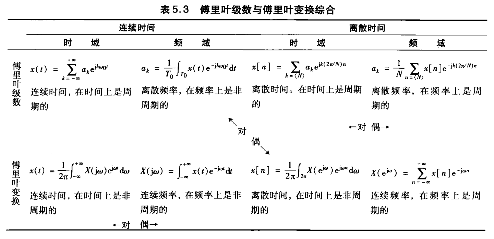

# 离散时间傅里叶变换

## 非周期信号的表示：离散时间傅里叶变换

### 离散时间傅里叶变换的导出

与连续时间类似，可以从傅里叶级数推导出**离散时间傅里叶变换对**：

$$
x[n]=\frac{1}{2\pi}\int_{2\pi}X(e^{j\omega})e^{j\omega n}d\omega
$$

$$
X(e^{j\omega})=\sum_{n=-\infty}^{+\infty}x[n]e^{-j\omega n}
$$

与离散型傅里叶级数类似，离散型傅里叶变换是以$2\pi$为周期的，因此取任意长度为$2\pi$的区间求积即可。其他相关概念与连续型类似，不再赘述。

$$
a_k = \frac{1}{N} X(e^{jk\omega_0})
$$

### 傅里叶变换的收敛

如果x[n]绝对可和，即$\sum_{n=-\infty}^{+\infty}|x[n]|<\infty$，或能量有限，即$\sum_{n=-\infty}^{+\infty}|x[n]|^2<\infty$，那么分析公式一定收敛。

综合公式没有收敛问题，也没有吉布斯现象

## 周期信号的傅里叶变换

情况与连续型类似：

$$
X(e^{j\omega})=\sum_{k=-\infty}^{+\infty}2\pi a_k\delta(\omega-\frac{2\pi k}{N})
$$

## 连续时间傅里叶变换性质

以下用$x[n]\overset{F}{\leftrightarrow}X(e^{j\omega})$表示傅里叶变换对

* 线性：$ax[n]+by[n]\overset{F}{\leftrightarrow}aX(e^{j\omega})+bY(e^{j\omega})$
* 时移：$x[n-n_0]\overset{F}{\leftrightarrow}e^{-j\omega n_0}X(e^{j\omega})$
* 频移：$e^{j\omega_0 n}x[n]\overset{F}{\leftrightarrow}X(e^{j(\omega-\omega_0)})$
* 共轭：$x^*[n]\overset{F}{\leftrightarrow}X^*(e^{-j\omega})$
* 时间反转：$x[-n]\overset{F}{\leftrightarrow}X(e^{-j\omega})$
* 时域扩展：  
  $x_{(k)}[n]=\left\{\begin{aligned}&x[n/k],&n为k的倍数\\&0,&n不为k的倍数\end{aligned}\right.$  
  也就是在原信号中间隔插入k-1个0。  
  $x_{(k)}[n]\overset{F}{\leftrightarrow} X(e^{jk\omega})$
* 卷积：$x[n]*y[n]\overset{F}{\leftrightarrow}X(e^{j\omega})Y(e^{j\omega})$
* 相乘：$x[n]y[n]\overset{F}{\leftrightarrow}\frac{1}{2\pi}\int_{2\pi}X(e^{j\theta})Y(e^{j(\omega-\theta)})d\theta$
* 时域差分：$x[n]-x[n-1]\overset{F}{\leftrightarrow}(1-e^{-j\omega}) X(e^{j\omega})$
* 累加：$\sum_{k=-\infty}^n x[k]\overset{F}{\leftrightarrow}\frac{1}{1-e^{-j\omega}}X(e^{j\omega})+\pi X(e^{j0})\sum_{k=-\infty}^{+\infty}\delta(\omega-2\pi k)$
* 频域微分：$nx[n]\overset{F}{\leftrightarrow}j\frac{d}{d\omega}X(e^{j\omega})$
* 实信号的共轭对称：当x[n]为实信号时，$X(e^{j\omega})=X^*(e^{-j\omega})$
* 实偶信号：当x[n]是实偶信号时，$X(e^{j\omega})$为实偶函数
* 实奇信号：当x[n]是实奇信号时，$X(e^{j\omega})$为纯虚奇函数
* 实信号的奇偶分解：$Ev\{x[n]\}\overset{F}{\leftrightarrow}Re\{X(e^{j\omega})\},Od\{x[n]\}\overset{F}{\leftrightarrow}jIm\{X(e^{j\omega})\}$
* 非周期信号的帕塞瓦尔定理：$\int_{-\infty}^{+\infty} |x[n]|^2dt\overset{F}{\leftrightarrow}\frac{1}{2\pi}\int_{2\pi} |X(e^{j\omega})|^2d\omega$

## 基本傅里叶变换对

|信号|傅里叶变换|傅里叶系数（若为周期的）|
|-|-|-|
|$\sum_{k=<N>}a_k e^{jk(2\pi/N)n}$|$2\pi\sum_{k=-\infty}^{+\infty}a_k\delta(\omega-\frac{2\pi k}{N})$|$a_k$|
|$e^{j\omega_0n}$|$2\pi \sum_{l=-\infty}^{+\infty}\delta(\omega-\omega_0-2\pi l)$|若$\omega_0=\frac{2\pi m}{N}$，则$a_k$在$k=m\pm lN,l\in Z$时为1，其他为0；若$\frac{\omega_0}{2\pi}$为无理数，则信号非周期|
|$\cos \omega_0n$|$\pi\sum_{l=-\infty}^{+\infty}[\delta(\omega-\omega_0-2\pi l)+\delta(\omega+\omega_0-2\pi l)]$|若$\omega_0=\frac{2\pi m}{N}$，则$a_k$在$k=\pm m\pm lN,l\in Z$时为$\frac 1 2$，其他为0；若$\frac{\omega_0}{2\pi}$为无理数，则信号非周期|
|$\sin \omega_0n$|$\frac{\pi}{j}\sum_{l=-\infty}^{+\infty}[\delta(\omega-\omega_0-2\pi l)+\delta(\omega+\omega_0-2\pi l)]$|若$\omega_0=\frac{2\pi r}{N}$，则$a_k$在$k=r\pm lN,l\in Z$时为$\frac{1}{2j}$，在$k=-r\pm lN,l\in Z$时为$-\frac{1}{2j}$，其他为0；若$\frac{\omega_0}{2\pi}$为无理数，则信号非周期|
|$x[n]=1$|$2\pi\sum_{l=-\infty}^{+\infty}\delta(\omega-2\pi l)$|$a_k=1,k=0,\pm N,\pm 2N,\cdots;其他a_k=0$|
|工作周期为$2N_1$周期为$N$的中心对称方波|书本有误|略|
|$\sum_{k=-\infty}^{+\infty}\delta[n-kN]$|$\frac{2\pi}{N}\sum_{k=-\infty}^{+\infty}\delta(\omega-\frac{2\pi k}{N})$|$a_k=\frac 1 N$|
|长度为$2N_1$的中心对称单周期方波|$\frac{\sin[\omega (N_1+1/2)]}{\sin(\omega/2)}$|-|
|$\frac{\sin(Wn)}{\pi n},0<W<\pi$|长度为2W的中心对称周期方波|-|
|$\delta[n]$|$1$|-|
|$u[n]$|$\frac{1}{1-e^{-j\omega}}+\sum_{k=-\infty}^{+\infty}\pi \delta(\omega-2\pi k)$|-|
|$\delta[n-n_0]$|$e^{-j\omega n_0}$|-|
|$a^nu[n],\mid a\mid<1$|$\frac{1}{1-ae^{-j\omega}}$|-|
|$(n+1)a^nu[n],\mid a\mid<1$|$\frac{1}{(1-ae^{-j\omega})^2}$|-|
|$\frac{(n+r-1)!}{n!(r-1)!}a^nu[n],\mid a\mid<1$|$\frac{1}{(1-ae^{-j\omega})^r}$|-|

## 对偶性

* 离散周期信号和离散傅里叶变换没有对偶性，但和离散傅里叶级数有对偶性：  
    若$g[n]\overset{FS}{\leftrightarrow}f[k]$，则$f[n]\overset{FS}{\leftrightarrow}\frac 1 N g[-k]$
* 离散时间傅里叶变换和连续傅里叶级数有对偶性：  
    不会

    
## 由线性常系数微分方程表征的系统

对于满足如下形式的线性常系数微分方程的系统：

$$
\sum_{k=0}^{N}a_k y[n-k]=\sum_{k=0}^{M}b_k\ x[n-k]
$$

可以通过如下的两个多项式之比求出其频率响应：

$$
H(e^{j\omega})=\frac{\sum_{k=0}^{M}b_k e^{-jk\omega}}{\sum_{k=0}^{N}a_k e^{-jk\omega}}
$$

通过待定系数将频率响应拆成$\frac{C}{(1-ae^{-j\omega})^r}$的和，即可得到若干个$C\frac{(n+r-1)!}{n!(r-1)!}a^nu[n]$的和的时域信号