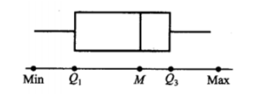

# 样本及抽样分布
## 随机样本
**总体**：试验的全部可能的观测值
**个体**：一个可能的观察值
**容量**：总体中包含的个体的个数  
根据容量是否有限可划分**有限总体**和**无限总体**
**样本**：从总体中抽取若干个体观察，这部分被抽取的个体称为样本，抽取数量称为样本容量
更严谨的定义：设X是具有分布函数F的随机变量，若$X_1,X_2,\cdots,X_n$是具有同一分布函数F的相互独立的随机变量，则称$X_1,X_2,\cdots,X_n$为从分布函数F（或总体F、或总体X）得到的**容量为n的简单样本**，简称**样本**，他们的观测值$x_1,x_2,\cdots,x_n$称为**样本值**，又被称为X的n个**独立的观测值**
## 直方图和箱线图
直方图和箱线图都是用于整理数据的工具

**频率直方图**：取一个包含所有数据的区间，将区间均分为n等份，每份长度称为**组距**$\Delta$，小区间的端点称为**组限**。然后统计落在各区间的数据个数，并在xoy平面上绘制成不同高度的等宽矩形，高度即y轴坐标等于$\frac{f_i}{n}/\Delta$，其中$f_i$为频数。当n很大时，由于频率接近于概率，因此一般来说频率直方图的外廓曲线接近于总体X的概率密度曲线

**样本分位数**：设有容量为n的样本观察值$x_1,x_2,\cdots,x_n$，样本p分位数(0<p<1)记为$x_p$，它具有以下性质：（1）至少有np个观察值小于或等于$x_p$（2）至少有n(1-p)个观察值大于或等于$x_p$。具体来说，若np不是整数，则样本p分位数为$x_{([np]+1)}$；若np是整数，则样本p分位数为$\frac{1}{2}[x_{(np)}+x_{(np+1)}]$。当p取0.25、0.5、0.75时，样本p分位数分别称为**第一四分位数**$Q_1$、**样本中位数**$Q_2或M$、**第三四分位数**$Q_3$

**箱线图**：记最大值为Max最小值为Min，具体画法如下。箱线图可以反映数据的中心位置、散布程度（区间越短越密集，越长越分散）、对称性。

## 抽样分布
### 统计量
设$X_1,X_2,\cdots,X_n$是来自总体X的一个样本，$g(X_1,X_2,\cdots,X_n)$是$X_1,X_2,\cdots,X_n$的函数，若g中*不含未知参数*，则称$g(X_1,X_2,\cdots,X_n)$是一个**统计量**。统计量是一个随机变量

常见统计量：

1. **样本均值**：$\bar X=\frac{1}{n}\sum_{i=1}^nX_i$
2. **样本方差**：$S^2=\frac{1}{n-1}\sum_{i=1}^n(X_i-\bar X)^2=\frac{1}{n-1}(\sum_{i=1}^n X_i^2 - n\bar X^2)$
3. **样本标准差**：$S=\sqrt{S^2}$
4. **样本k阶（原点）矩**：$A_k=\frac{1}{n}\sum_{i=1}^nX_i^k,k=1,2,\cdots$
	> 当$n\to \infty$时，$A_k\overset{P}{\rightarrow}\mu_k$

5. **样本k阶中心矩**：$B_k=\frac{1}{n}\sum_{i=1}^n(X_i-\bar X)^k,k=2,3,\cdots$
这些统计值的观测值分别记为$\bar x,s^2,s,a_k,b_k$，均可类似地由样本观察值算出

### 经验分布函数

设$x_1,x_2\cdots,x_n$是来自分布函数为F(x)的总体X的样本观察值的经验分布函数，记为$F_n(x)$，定义为样本观察值$x_1,x_2\cdots,x_n$中小于或等于指定值x所占的比例，即

$$F_n(x)=\frac{\#(x_i<x)}{n},-\infty<x<\infty$$

其中$\#(x_i<x)$表示$x_1,x_2\cdots,x_n$中小于或等于x的个数。

不难发现$F_n$是分布函数。

设$X_1,X_2\cdots,X_n$是来自以F(x)为分布函数的总体X的样本，$F_n(x)$是经验分布函数，则有

$$P\{\lim_{n\to\infty}\sup_{-\infty<x<\infty}|F_n(x)-F(x)|=0\}=1$$

其中sup是上确界的意思。
也就是说当n充分大时，经验分布函数能很好地逼近分布函数

### $\chi^2$分布

**伽马函数**：

$$\Gamma(\alpha)=\int_0^\infty x^{\alpha-1}e^{-x}dx$$

其具有以下性质：

1. 对$\alpha\geq1，\Gamma(\alpha+1)=\alpha\Gamma(\alpha)$
2. 对正整数n，$\Gamma(n)=(n-1)!$
3. $\Gamma(\frac{1}{2})=\pi^{\frac{1}{2}}$

**伽马分布**：
若随机变量X服从参数为$\alpha>0,\theta>0$的伽马分布，则记为$X\sim \Gamma(\alpha,\theta)$，其概率密度为

$$f(x)=\left\{\begin{aligned}&\frac{1}{\theta^\alpha\Gamma(\alpha)}x^{\alpha-1}e^{-x/\theta},&y>0,\\&0,&其他.\end{aligned}\right.$$

若$X\sim \Gamma(\alpha,\theta),Y\sim \Gamma(\beta,\theta)$，则$X+Y\sim\Gamma(\alpha+\beta,\theta)$。这可以推广到任意多伽马分布的加和

$\chi^2$**分布**
设$X_1,X_2,\cdots,X_n$是来自总体N(0,1)的样本，则称统计量$\chi^2=X_1^2+X_2^2+\cdots+X_n^2$为服从自由度为n的$\chi^2$**分布**，记为$\chi^2\sim\chi^2(n)$，其概率密度为

$$f(y)=\left\{\begin{aligned}&\frac{1}{2^{n/2}\Gamma(n/2)}y^{n/2-1}e^{-y/2},&y>0,\\&0,&其他.\end{aligned}\right.$$

可以发现，服从自由度为n的$\chi^2\sim\Gamma(\frac{n}{2},2)$

卡方分布满足可加性：若$\chi_1^2\sim\chi^2(n_1),\chi_2^2\sim\chi^2(n_2)$，则$\chi_1^2+\chi_2^2\sim\chi^2(n_1+n_2)$

卡方分布的期望为n，方差为2n。

设$\chi_\alpha^2(n)$是$\chi^2(n)$的上$\alpha$分位数，当n充分大时，$\chi_\alpha^2(n)\approx\frac{1}{2}(z_\alpha+\sqrt{2n-1})^2$，其中$z_\alpha$是标准正态分布的上$\alpha$分位数

### t分布
设$X\sim N(0,1),Y\sim \chi^2(n)$，且X,Y相互独立，则称随机变量

$$t=\frac{X}{\sqrt{Y/n}}$$

服从自由度为n的**t分布**，或称为学生氏分布，记为$t\sim t(n)$，其概率密度为

$$h(t)=\frac{\Gamma[(n+1)/2]}{\sqrt{\pi n}\Gamma(n/2)}\left(1+\frac{t^2}{n}\right)^{-(n+1)/2},-\infty<t<\infty$$

t分布相对y轴对称。当n足够大时t分布近似于标准正态分布。

### F分布
设$U\sim \chi^2(n_1),V\sim \chi^2(n_2)$，且U,V相互独立，则称随机变量

$$F=\frac{U/n_1}{V/n_2}$$

服从自由度为$(n_1,n_2)$的**F分布**，记为$F\sim F(n_1,n_2)$，其概率密度为

$$\psi(y)=\left\{\begin{aligned}&\frac{\Gamma[(n_1+n_2)/2](n_1/n_2)^{n_1/2}y^{(n_1/2)-1}}{\Gamma(n_1/2)\Gamma(n_2/2)[1+(n_1y/n_2)]^{(n_1+n_2)/2}},&y>0,\\&0,&其他.\end{aligned}\right.$$

可以证明$\frac{1}{F}\sim F(n_2,n_1),F_{1-\alpha}(n_1,n_2)=\frac{1}{F_\alpha(n_2,n_1)}$

### 正态总体的样本均值与样本方差的分布
设$X_1,X_2,\cdots,X_n$是来自正态总体$N(\mu,\sigma^2)$的样本，$\bar X$是样本均值,$S^2$是样本方差，则有

1. $\bar X\sim N(\mu, \sigma^2/n)$
2. $\frac{(n-1)S^2}{\sigma^2}\sim \chi^2(n-1)$
3. 样本均值和样本方差相互独立
4. $\frac{\bar X-\mu}{S/\sqrt n}\sim t(n-1)$

设$X_1,X_2,\cdots,X_{n_1}$是来自正态总体$N(\mu_1,\sigma_1^2)$的样本，$Y_1,Y_2,\cdots,Y_{n_2}$是来自正态总体$N(\mu_2,\sigma_2^2)$的样本，$\bar X,\bar Y$分别是X和Y的样本均值,$S_1^2, S_2^2$分别是X和Y的样本方差，则有

1. $\frac{S_1^2/S_2^2}{\sigma_1^2/\sigma_2^2}\sim F(n_1-1,n_2-1)$
2. 当$\sigma_1^2=\sigma_2^2=\sigma^2$时
	
$$\frac{(\bar X-\bar Y)-(\mu_1-\mu_2)}{S_w\sqrt{\frac{1}{n_1}+\frac{1}{n_2}}}\sim t(n_1+n_2-2)$$

其中$S_w^2=\frac{(n_1-1)S_1^2+(n_2-1)S_2^2}{n_1+n_2-2},S_w=\sqrt{S_w^2}$
