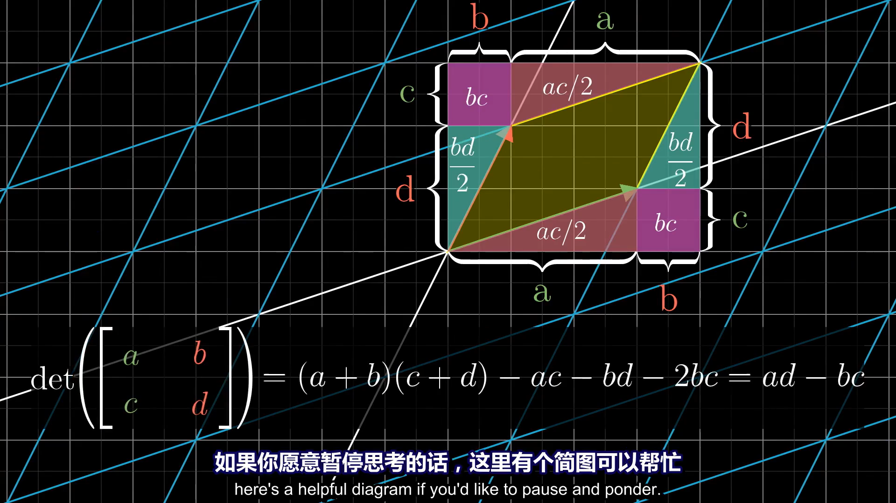
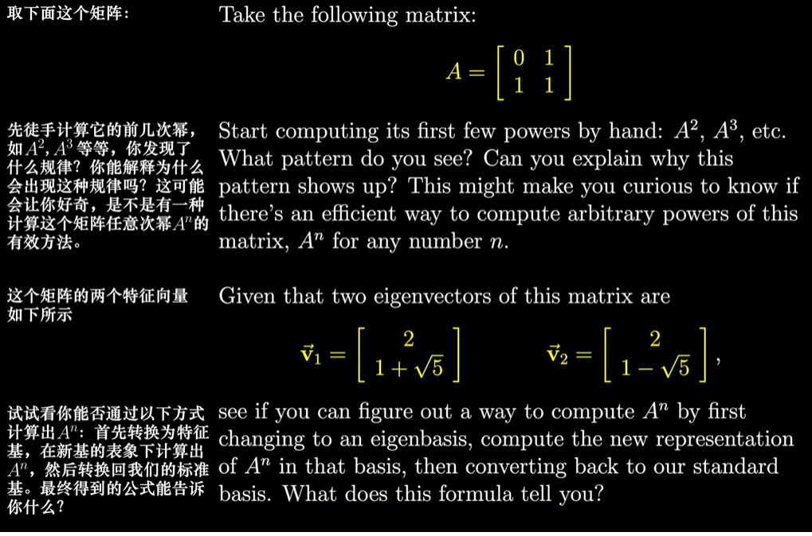

# 3Blue1Brown线性代数的本质

## 00-序言

> 尽管一批教授和教科书编者用关于矩阵的荒唐至极的计算内容掩盖了**线性代数**的简明性，但是鲜有与之相较更为初等的理论
——让·迪厄多内

* 线性代数是学习任何技术学科都需要掌握的科目之一，但初次学习的学生很容易浅层次地但从计算角度来理解，而搞不清其潜在的几何含义。

* 几何水平的理解可以：
    1. 判断出解决特定问题需要用什么样的工具
    2. 感受他们为什么有用
    3. 解读最终结果

* 数值水平的理解可以：让你顺利应用这些工具

* 本系列视频的目标在于将线性代数的几何直觉可视化

* 你不能通过区区几个视频就能学习一门完整的学科，这一点不言而喻，这也不是本系列视频的目标。但对于这个学科而言，本系列视频可以让你建立正确的几何直观，以便你在接下来的学习中收获累累硕果。
## 01-向量是什么

> （参照一维连续统的特定划分模式来）引入一些数作为坐标是一种鲁莽的行为。
赫尔曼·外尔

* 几何：向量（Vector）是空间中的箭头  
* 代数：向量是一个有序列表  
* 向量加法和数乘可以从代数和几何两个角度理解，见高中数学  
* 几何意义上，向量也可以看作对空间所有的点的作用，加法就是平移，数乘就是缩放  
* 写法：
$\begin{bmatrix}1\\2\end{bmatrix}$

## 02-线性组合、张成的空间与基

> 数学需要的不是天赋，而是少量的**自由想象**，但想象太过自由又会陷入疯狂。 
——Angus K. Rodgers

* **基（Base）**：向量空间的一组基是张成该空间的一个线性无关向量集，表示为$\hat i$，$\hat j$等；平面中任意一个向量$\vec a = \begin{bmatrix}x\\y\end{bmatrix}$均可表示为$\vec a = x\cdot \hat i + y\cdot \hat j$，其中的x和y可看作是对基向量的缩放。

* **线性组合（Linear combination）**：两个数乘向量的和被称为这两个向量的线性组合，如$a\vec v + b\vec w$为$\vec v$和$\vec w$的线性组合

* **张成的空间（Span）**：所有可以表示为给定向量线性组合的向量的集合被称为给定向量张成的空间

* **线性相关（Linearly dependent）**：在线性代数里，向量空间的一组元素中，若没有向量可用有限个其他向量的线性组合所表示，则称为线性无关或线性独立 (linearly independent)，反之称为线性相关(linearly dependent)。

## 03-矩阵与线性变换

> 很遗憾，矩阵是什么是说不清的。你必须得自己亲眼看看。
 ——墨菲斯

* **线性变换（Linear transformation）**：线性变换是一个输入一个向量后输出另一个向量的特殊函数，强调运动性；线性可以理解为向量空间中任意一条直线上的点集合对应向量集合在变换后的向量集合对应的点集合仍构成一条直线，且零向量变换后仍为零向量；线性变换还可以理解为“保持网格线平行且等距分布”的变换。

* 线性变换的表述：只需知道一组基向量线性变换后的向量即可表述出该线性变换，因为线性变换前后的任意一个向量可以用相应变换前后的同一组基向量用相同的线性组合表示。也就是说，一个线性变换可以用变换后基向量的坐标表示，如对向量$\vec v = \begin{bmatrix}x\\y\end{bmatrix}$进行线性变换后的向量$\vec u$可表示为$\vec u = x\cdot \begin{bmatrix}a\\b\end{bmatrix} + y\cdot \begin{bmatrix}c\\d\end{bmatrix} = \begin{bmatrix}xa+yc\\xb+yd\end{bmatrix}$。

* **矩阵（Matrix）**：矩阵是一个按照长方阵列排列的复数或实数集合。特别地，把平面线性变换后的两个基向量$\hat i = \begin{bmatrix}a\\c\end{bmatrix}$和$\hat j = \begin{bmatrix}b\\d\end{bmatrix}$组合成2x2矩阵$\begin{bmatrix}a&b\\c&d\end{bmatrix}$可以用来表示该线性变换。

* 用矩阵对向量的作用表示线性变换：对一个向量进行线性变换，可以用一个矩阵乘以该向量表示，记作$\begin{bmatrix}a&b\\c&d\end{bmatrix}\begin{bmatrix}x\\y\end{bmatrix}=x\begin{bmatrix}a\\c\end{bmatrix}+y\begin{bmatrix}b\\d\end{bmatrix}=\begin{bmatrix}ax+by\\cx+dy\end{bmatrix}$

* 一些线性变换的实例：
  * 逆时针旋转90°：$\begin{bmatrix}0&-1\\1&0\end{bmatrix}$
  * 剪切/错切（Shear）：$\begin{bmatrix}1&1\\0&1\end{bmatrix}$
  
* **列线性相关（Linearly dependent columns）**：若线性变换后的基向量存在线性相关，则称对应矩阵的对应列为列线性相关。对向量空间进行列线性相关的线性变换会导致“降维打击”。

## 04-矩阵乘法与线性变换复合

> 据我的经验，如果丢掉矩阵的话，那些涉及矩阵的证明可以缩短一半。
——埃米尔·阿廷

* **矩阵乘法（Matrix Multiplication）**：两个矩阵相乘可以用来表示两个线性变换先后作用，其中置于右边的矩阵（记为$M_1=\begin{bmatrix}a&b\\c&d\end{bmatrix}$）先进行，左边的（记为$M_2=\begin{bmatrix}e&f\\g&h\end{bmatrix}$）后进行。也就是说从左往右看，类似于复合函数。

* 运算方法：对$M_2$中的第一第二列拆分（即$M_2$变换后的$\hat i$与$\hat j$坐标）分别进行$M_1$变换，得到最终的基向量合并成矩阵，即：

$$
\begin{bmatrix}a&b\\c&d\end{bmatrix}\begin{bmatrix}e&f\\g&h\end{bmatrix}=\begin{bmatrix}ae+bg&af+bh\\ce+dg&ch+dh\end{bmatrix}
$$

## 附注1-三维空间中的线性变换

> Lisa：呃，我爸爸到底在哪？  
Frink：对于能拿到双区拓扑学高等学位的傻瓜来说，这一点也足够明显——Homer Simpson误入了（关灯）三维空间！
（辛普顿的一家 第七季第六集）

* 类比二维空间，三维空间可以引入z轴上的基向量$\hat k$，并保持x轴和y轴上的基向量$\hat i$和$\hat j$，从而组成三维空间中的基

* 三维空间中的线性变换实例：
  * 沿x轴正方向顺时针旋转90°：$\begin{bmatrix}1&0&0\\0&0&-1\\0&1&0\end{bmatrix}$
  * 沿y轴正方向顺时针旋转90°：$\begin{bmatrix}0&0&1\\0&1&0\\-1&0&0\end{bmatrix}$

* 在三维空间中用基表示向量：$\vec v=x\hat i+y\hat j+z\hat k$

* 三维空间中的线性变换：$\begin{bmatrix}0&1&2\\3&4&5\\6&7&8\end{bmatrix}\begin{bmatrix}x\\y\\z\end{bmatrix}=x\begin{bmatrix}0\\3\\6\end{bmatrix}=y\begin{bmatrix}1\\4\\7\end{bmatrix}=z\begin{bmatrix}2\\5\\8\end{bmatrix}$

* 3x3矩阵乘法实例：$\begin{bmatrix}0&-2&2\\5&1&5\\1&4&-1\end{bmatrix}\begin{bmatrix}0&1&2\\3&4&5\\6&7&8\end{bmatrix}=\begin{bmatrix}6&6&6\\33&44&55\\6&10&14\end{bmatrix}$

## 05-行列式

> 计算的目的不在于数字本身，而在于洞察其背后的含义。
——理查德·哈明

* **行列式（determinant）**:行列式是一个输入正方形矩阵，输出一个标量的函数，可以用来度量线性变换对空间的缩放比例，记作$\det ()$。

* 比如$\det \left(\begin{bmatrix}3&2\\0&2\end{bmatrix}\right )=6$，表示对于一个二维空间中面积为S的封闭图形，进行该线性变换面积变为6S。

* 直观上行列式的结果也可以用线性变换前后空间的缩放比例估测。

* 特别的，若线性变换会使空间压缩到更小的维度，则它的行列式结果为0。

* 行列式取值可以为负数，这表示空间发生了变向。对于二维空间，这意味着两个基向量的相对方向改变（如原来$\hat i$在$\hat j$右侧变为$\hat i$在$\hat j$左侧）；对于三维空间，这意味着坐标系从右手系变为左手系（或反之）。此时行列式结果的绝对值仍然可以代表空间的缩放比例。

* $\det \left(\begin{bmatrix}a&b\\c&d\end{bmatrix}\right )=ad-bc$  
证明提示：

## 06-逆矩阵、列空间与零矩阵

> 提出正确的问题比回答它更困难。
格奥尔格·康托尔 

### 求解线性方程组
**线性方程组（Linear system of equation）**：线性方程组是各个方程关于未知量均为一次的方程组，如：

$$
\begin{cases} 2x+5y+3z=-3\\4x+0y+8z=0\\1x+3y+0z=2\end{cases}
$$

不难发现，上面的方程组也可以表示成一个向量方程：

$$
\begin{bmatrix}2&5&3\\4&0&8\\1&3&0\end{bmatrix}\begin{bmatrix}x\\y\\z\end{bmatrix}=\begin{bmatrix}-3\\0\\2\end{bmatrix}
$$

可以记作$A\vec x=\vec v$，则解该方程组相当于求$\vec x$使其经过$A$变换后得到$\vec v$。对此，一个思路是对$\vec v$进行$A$的逆变换，对应矩阵称为$A$的**逆矩阵（Inverse matrices）**，记作$A^{-1}$。显然，$A^{-1}A$等于一个“什么都不做”的矩阵，这种变换称为**恒等变换**，这里为$\begin{bmatrix}1&0&0\\0&1&0\\0&0&1\end{bmatrix}$。于是，$\vec x=A^{-1}A\vec x=A^{-1}\vec v$，这样就解出了这个方程组。

需要注意的是，对于会导致“降维”的变换（即矩阵行列式结果为0），其矩阵并不存在逆矩阵——你当然不能无中生有。事实上，在二维空间尝试这样做时需要使该变换将一个向量映射成一条直线上的多个向量，这不符合函数的定义（一一对应）。

这并不意味着$A\vec x=\vec v$一定无解。当$\vec v$落在$A$变换后基的张成空间内时，存在无数解。

当$\det (A)=0$时，变换后的空间被“压缩”，“压缩”后的空间维数被称为**秩（Rank）**。对于一个nxn的矩阵，其秩最高为n。所有可能的输出向量$A\vec u$的集合称为$A$的**列空间（Column space）**，也就是矩阵的列张成的空间。那么秩的严谨定义就是列空间的维数。当秩达到最大值（与矩阵的维数相同）时，这个矩阵被称为**满秩（Full rank）**。

零向量总在任何矩阵的列空间中。对于满秩变换，唯一能变换后落在原点的就是零向量自身；但对于非满秩变换，可以有多个向量能在变换后成为零向量。变换后落在原点的向量集合，被称为矩阵的**零空间（Null space）**或**核（Kernel）**。

综上所述，在解线性方程时可以等价于求解向量方程。当矩阵行列式结果不为零时可以用逆矩阵求解；当矩阵行列式结果为零时，可以用列空间判断是否有解，若有解，则解的集合即为零空间。

## 附注2-非方阵

> “在这个小测试里，我让你们求一个2x3矩阵的行列式。让我感到非常可笑的是，你们当中竟然有人尝试去做。” 
——摘自 mathprofessorquotes.com ，作者佚名

非方阵可以用来表示跨维度空间的线性变换。

比如这个3x2矩阵$\begin{bmatrix}2&0\\-1&1\\-2&1\end{bmatrix}$就可以把一个二维平面上的向量变换成三维空间中的向量。注意这个矩阵的列空间是一个过原点平面，也就是说它并没有“升维”，该矩阵仍然是满秩的。

同理，一个2x3矩阵可以代表一个从三维空间到平面的线性变换，列空间为平面，非满秩。

## 07-点积与对偶性

> 卡尔文：你知道吗，我觉得数学不是一门科学，而是一种宗教。  
霍布斯：一种宗教？  
卡尔文：是啊。这些公式就像奇迹一般。你取出两个数，把它们相加时，它们神奇地成为了一个全新的数！没人能说清这到底是怎么发生的。你要么完全相信，要么完全不信。
（《卡尔文与霍布斯》连载四格漫画，1991/03/06） 

* **点积（Dot product）**：点积就是对维度相同的两个向量每个对应元素相乘后加和得到标量，又称向量的内积，即高中的点乘。其几何理解高中已介绍，不再赘述。

* 严格的线性性质：
  1. $L(\vec v+\vec w)=L(\vec v)+L(\vec w)$
  2. $L(c\vec v)=cL(\vec v)$
  
* 对偶性可以用来证明点积的几何形式与线性变换之间的联系，进而证明点积的代数形式与几何形式之间的联系，详细过程见视频。

* 总的来说，视频的目的是给我们多一个看待向量的视角（将向量看作一次线性变换）

## 08-叉乘
### 第一部分-叉乘的标准介绍
> “每一个维度都很特别。”

——杰弗里·拉加里亚斯

> 注：为了美观，这一章中的叉乘运算形成的矩阵与教材不同，互为倒置，但结果相同。
* 非严格意义上的叉乘：平面中两个向量构成的平行四边形的大小，若取向为逆时针则为正，否则为负

* 非严格意义上的叉乘计算：不妨将输入的两个向量看作线性变换后的两个基向量，那么它们形成的平行四边形可以用行列式算（类似的，三维中行列式也可以计算三个向量构建的平行六面体的体积）。比如$\vec v = \begin{bmatrix}3\\1\end{bmatrix},\vec w = \begin{bmatrix}2\\-1\end{bmatrix}$，则$\vec v \times \vec w = \det \left (\begin{bmatrix}3&2\\1&-1\end{bmatrix}\right )$

* **叉乘（Cross product）**：叉乘又称外积，两个三维向量$\vec a,\vec b$叉乘得到另一个向量，其大小等于$|\vec a||\vec b|\sin \langle \vec a , \vec b \rangle$，方向遵守右手定则。几何上，叉乘结果的大小等于两向量围成平行四边形的大小。

* 叉乘计算：
  * 纯计算：$\begin{bmatrix}v_1\\v_2\\v_3\end{bmatrix}\times \begin{bmatrix}w_1\\w_2\\w_3\end{bmatrix}=\begin{bmatrix}v_2w_3-w_2v_3\\v_3w_1-w_3v_1\\v_1w_2-w_1v_2\end{bmatrix}$
  * 技巧性：将基向量当作标量来组成矩阵，并应用行列式，即
  
$$
\begin{bmatrix}v_1\\v_2\\v_3\end{bmatrix}\times \begin{bmatrix}w_1\\w_2\\w_3\end{bmatrix}=\det \left (\begin{bmatrix}\hat i&v_1&w_1\\\hat j&v_2&w_2\\\hat k&v_3&w_3\end{bmatrix}\right)=\hat i (v_2w_3-w_2v_3)+\hat j(v_3w_1-w_3v_1)+\hat k(v_1w_2-w_1v_2)=\begin{bmatrix}v_2w_3-w_2v_3\\v_3w_1-w_3v_1\\v_1w_2-w_1v_2\end{bmatrix}
$$

### 第二部分-以线性代数的眼光看叉积

> 从他（格罗滕迪克）和他的作为中，我还学到一点：不以高难度的证明为傲，因为难度高意味着我们还不理解。理想的情况是能够绘出一幅美景，而其中的证明显而易见。
皮埃尔·德利涅

> 该部分主要是对上面的叉积技巧性计算方法进行几何角度的证明。~~没搞懂作者的意图。~~

* **对偶性（Duality）**：每当你看到一个（多维）空间到数轴的线性变换时，他都与那个空间中的唯一一个向量（称为**对偶向量（Dual vector）**）对应，也就是说应用线性变换和与这个向量点乘等价。

#### 1. 根据$\vec v$和$\vec w$定义一个三维到一维的线性变换
定义一个函数作为桥梁：$f\left (\begin{bmatrix}x\\y\\z\end{bmatrix}\right )=\det \left (\begin{bmatrix}x&v_1&w_1\\y&v_2&w_2\\z&v_3&w_3\end{bmatrix}\right )$
研究该函数，发现函数为线性的，那么根据对偶性，这个从三维到一维的线性变换必然对应着一个对偶向量。
> 证明：
>
> 1. $f(\vec a+\vec b)=f(\vec a)+f(\vec b)$
>
>    ~~可以爆算（啊不是）~~
>    不妨先讨论行列式的计算。从几何上看，三维矩阵的行列式可以看作求三个向量围成的平行六面体体积，根据柱体体积的计算公式，它就是底乘高。那么对于这个函数而言，可以看作由$\vec v$和$\vec w$形成的平行四边形的面积（是个常数，设为S）乘上输入向量在已知的$\vec v$和$\vec w$所在平面的法向量（是个常量，设为$\vec n$）的投影。于是，$f(\vec x)=|\vec x|cos\langle \vec x,\vec n\rangle \cdot S$。将这个代入到原式约掉S，发现问题变成了证明两个向量和的投影等于这两个向量投影的和，这在几何上很容易证明（自己作个图看看）。
>
> 2. $cf(\vec a)=f(c\vec a)$
>    
>    这个更简单，把式子像上面那样拆开就证完了，几何上也很好理解。
>
> 综上所述，这个新函数是线性的。
#### 2. 找到它的对偶向量（设为$\vec p$）
研究这个函数，发现它是一个输入三维向量，输出实数（看作一维向量）的一个函数，那么这个线性变换可以用一个1x3的矩阵来表示，这个矩阵对应的对偶向量就是所求。根据对偶性，这个线性变换的结果等于对偶向量与输入向量的点乘。也就是  说：

$$
f\left(\begin{bmatrix}x\\y\\z\end{bmatrix}\right)=\begin{bmatrix}p_1&p_2&p_3\end{bmatrix}\begin{bmatrix}x\\y\\z\end{bmatrix}=\begin{bmatrix}p_1\\p_2\\p_3\end{bmatrix}\cdot\begin{bmatrix}x\\y\\z\end{bmatrix}=\det \left (\begin{bmatrix}x&v_1&w_1\\y&v_2&w_2\\z&v_3&w_3\end{bmatrix}\right )
$$

展开后面那部分得到：

$$
p_1x+p_2y+p_3z=x(v_2w_3-w_2v_3)+y(v_3w_1-w_3v_1)+z(v_1w_2-w_1v_2)
$$

要使等式恒成立，则：

$$
\begin{cases}p_1=v_2w_3-w_2v_3\\p_2=v_3w_1-w_3v_1\\p_3=v_1w_2-w_1v_2\end{cases}
$$

即：

$$
\vec p=\begin{bmatrix}v_2w_3-w_2v_3\\v_3w_1-w_3v_1\\v_1w_2-w_1v_2\end{bmatrix}
$$

#### 3. 说明这个对偶向量就是$\vec v \times \vec w$
上面的计算过程就是那个叉乘计算技巧的来由，即本质上那个技巧是在求$\vec p$。事实上，计算结果已经证明了$\vec p$和$\vec v \times \vec w$在代数上相同，那么几何上呢？

下面从几何角度证明$\vec p=\vec v\times\vec w$:

>
>再来看一遍这个式子

$$\begin{bmatrix}p_1\\p_2\\p_3\end{bmatrix}\cdot\begin{bmatrix}x\\y\\z\end{bmatrix}=\det \left (\begin{bmatrix}x&v_1&w_1\\y&v_2&w_2\\z&v_3&w_3\end{bmatrix}\right)$$

从几何上看，右边可以看作求$\vec x,\vec v,\vec w$构成的平行六面体的体积，即$\vec v,\vec w$形成的平行四边形的面积乘以$\vec x$在它法向量的投影。那$\vec p$是什么的时候点乘$\vec x$等于这个值呢——显然就是当方向垂直于平行四边形，大小等于平行四边形面积的时候嘛！（记得考虑$\vec x$任取）而且不难发现点积结果的正负和行列式结果的正负恰好对应。这时的$\vec p$就是$\vec v \times \vec w$。

那么我们就揭示出了叉乘计算技巧的背景，以及在几何上与叉乘定义的契合。

## 09-基变换
    
> 数学是一门赋予不同事物相同名称的艺术。
——昂利·庞加莱

* 首先需要将坐标系和空间分离。向量可以单独在空间中存在，但要将向量用坐标来表示，则必须先建立坐标系。这里我们认为空间中原点是确定的，但坐标系的建立还需要坐标轴方向和单位长度，这需要就需要用基向量来定义。

* 我们选择向右为x轴正方向，向上为y轴正方向，xy轴单位长度相同，这样我们就建立了平时最常见到的横平竖直平面直角坐标系（记为A）。但我们完全可以选取不同的基向量。比如相对于我们刚才建立的坐标系选取$\begin{bmatrix}1\\2\end{bmatrix}$为$\hat i$，选取$\begin{bmatrix}-1\\0\end{bmatrix}$为$\hat j$，这同样是一个坐标系（记为B），而且这个坐标系中相同向量的坐标与前者不同！比如在A坐标系中坐标为$\begin{bmatrix}0\\2\end{bmatrix}$的向量在B坐标系中坐标为$\begin{bmatrix}1\\1\end{bmatrix}$
* 那么在不同坐标系中，一个向量的坐标怎么转化呢。在一个坐标系中，坐标到向量的转化本质上是对基向量的缩放与加和，那么我们已知B坐标轴基向量在A坐标轴的坐标，就可以用坐标的定义算出B坐标轴中任意坐标在A坐标轴的坐标啦！比如对于在B坐标轴中坐标为$\begin{bmatrix}1\\1\end{bmatrix}$的向量，在A坐标轴的坐标就是$1\begin{bmatrix}1\\2\end{bmatrix}+1\begin{bmatrix}-1\\0\end{bmatrix}=\begin{bmatrix}0\\2\end{bmatrix}$

* 事实上这就是矩阵向量乘法的操作，可以说这是之前讲过的的线性变换的另一个理解角度。

* 那么已知向量在A坐标轴的坐标，又怎么求它在B坐标轴的坐标呢。这就需要逆矩阵了，它可以将一个线性变换逆向进行。比如说从B坐标轴坐标到A坐标轴坐标需要用到矩阵$\begin{bmatrix}1&-1\\2&0\end{bmatrix}$，它的逆矩阵$\begin{bmatrix}1&-1\\2&0\end{bmatrix}^{-1}=\begin{bmatrix}0&0.5\\-1&0.5\end{bmatrix}$，那么对于在A坐标轴中坐标为$\begin{bmatrix}0\\2\end{bmatrix}$的向量，在B坐标轴的坐标就是$\begin{bmatrix}0&0.5\\-1&0.5\end{bmatrix}\begin{bmatrix}0\\2\end{bmatrix}=\begin{bmatrix}1\\1\end{bmatrix}$

* 这个新视角可以帮我们理解不同坐标系下的线性变换。比如现在有一个B坐标系坐标表述的向量$\begin{bmatrix}1\\1\end{bmatrix}$、A坐标系坐标表述的线性变换$\begin{bmatrix}0&-1\\1&0\end{bmatrix}$（逆时针旋转90°），求这个向量在变换后在B坐标系中的坐标为$\begin{bmatrix}1&-1\\2&0\end{bmatrix}^{-1}\begin{bmatrix}0&-1\\1&0\end{bmatrix}\begin{bmatrix}1&-1\\2&0\end{bmatrix}\begin{bmatrix}1\\1\end{bmatrix}=\begin{bmatrix}0\\2\end{bmatrix}$（先把B的坐标转换成A的坐标，执行变换，再转换回B的坐标）

## 特征向量与特征值

> “上一次演讲中我问道：‘数学对你来说意味着什么？’有些人回答：‘处理数字，处理结构。’那么如果我问音乐对你来说意味着什么，你会回答‘处理音符’吗？” 
塞尔日·兰

### 普遍的

* 考虑任意一个线性变换，比如$\begin{bmatrix}3&1\\0&2\end{bmatrix}$，并任意选择一个向量和它的张成空间，你会发现大部分向量在变换后都离开了其张成的空间，但也有少部分向量变换后仍在其张成空间中，也就是这次变换对它来说只是拉伸而不改变方向。在这次变换中，$\hat i$就是这样的一个向量，并且在其张成空间中的任意一个向量都是，被伸长了**3**倍；类似的$\begin{bmatrix}-1\\1\end{bmatrix}$和它张成空间上的向量也是，被伸长了**2**倍。以上就是所有满足*变换后仍留在它们张成空间里*的向量，它们就被称为变换的**特征向量（Eigenvector）**（规定零向量不是特征向量），每个特征向量在变换中拉伸或压缩比例的因子被称为**特征值（Eigen value）**（负数表示改变方向，类似于向量的数乘中的标量）。

* 研究的意义：
    1. 对于三维中旋转变换，特征向量的张成空间就是这次变换旋转轴，这会比用3x3矩阵表述直观得多。在旋转中，特征值为1.
    2. 用矩阵表述的线性变换依赖于坐标轴的选取（也就是说同一个线性变换在不同的坐标系中用矩阵的表述往往不同），而用特征向量和特征值表述则依赖程度更低（从几何上看，特征向量和特征值在不同坐标系中是相同的）
    
* 计算方式概述：
    1. 设$A$为变换矩阵，$\vec v$为特征向量，$\lambda$为特征值，则它们的关系为$A\vec v=\lambda\vec v$（$\vec v\neq \vec 0$）。因此求解特征向量和特征值就是求解使这个等式成立的$\vec v$和$\lambda$。
    2. 同构：用$\lambda$构造矩阵$B$使$B\vec v=\lambda\vec v$（$B$和$A$不同点在于，$A$是完全已知的，而$B$含有未知数$\lambda$）。根据矩阵的含义（或者计算角度）可以发现，$B$是一个对角元均为$\lambda$，其余位置都是0的矩阵。通常会被记作$\lambda I$，其中$I$为单位矩阵，对角元均为1（就是那个等价于什么都不做的矩阵）。
    3. 移项变换得到$(A-\lambda I)\vec v=\vec 0$。这意味着左边这个复合变换（其矩阵记为$C$）将空间压缩到更低的维度，由行列式的性质可得知当且仅当$\det (A-\lambda I)=0$时等式成立。
    
* 实际计算的细节：
    * 设$C=\begin{bmatrix}a-\lambda&b\\c&d-\lambda\end{bmatrix}$，则$\det (C)=0$相当于$(a-\lambda)(d-\lambda)-bc=0$，其中$abcd$均为已知，$\lambda$未知，则解$\lambda$在计算上的就是在解一个一元二次方程。
    * 解出$\lambda$后就可以算出$C$，而$C$的零空间中的向量集合就是所有特征向量$\vec v$的集合。
    * 从上面的一元二次方程求解中可以发现，一个线性变换并不一定有特征向量（比如平面中的90°旋转，解方程时会发现无实数解，而复数解会和复平面变换有一定关联，超纲略过）；也可能特征向量在一条直线上（比如平面中的剪切变换，解方程时会发现只有一个实数解）。另外，单个特征值的特征向量可以不止在一条直线上（比如将每一个向量变为两倍的平面变换，对应的$C$秩为0，零空间是整个平面，特征向量也是平面中的所有非零向量）
    
### 特征基
* 当一组基恰好为特征向量时，它们被称为**特征基（Eigenbasis）**。对应变换的矩阵除对角元外都为0，因此被称为**对角矩阵（Diagonal matrix）**，它意味着所有基向量都是特征向量，矩阵的对角元就是它们所属的特征值。

* 对角矩阵在多次与自己相乘的运算中非常方便，只需将对角元进行对应次数的幂运算即可。相比来说非对角矩阵的多次自乘运算则复杂得多。

* 对于矩阵不是对角矩阵的变换，如果它的特征向量能够张成全空间，也可以通过变换坐标系使这些特征向量就是基向量（也就是基变换，见上一章）。并非所有矩阵都能对角化。

### 一条题
  
我的答案：

+ $A^1=\begin{bmatrix}0&1\\1&1\end{bmatrix},  A^2=\begin{bmatrix}1&1\\1&2\end{bmatrix},  A^3=\begin{bmatrix}1&2\\2&3\end{bmatrix}$

经过弹幕大佬提示和我自己推算，发现它和斐波那契数列有关，于是先推出递推式：

$$A^n=\begin{bmatrix}0&1\\1&1\end{bmatrix}\begin{bmatrix}a&b\\c&d\end{bmatrix}=\begin{bmatrix}c&d\\a+c&b+d\end{bmatrix}$$

用数学归纳法不难得出，矩阵的每个位置都是斐波那契数列的一部分。设斐波那契数列第n项为$T(n)$，则

$$\begin{bmatrix}T(n-1)&T(n)\\T(n)&T(n+1)\end{bmatrix}$$

+ 求$A^n$：
    1. 转换为特征基：  
        将标准基转换为特征基，我们要进行$\begin{bmatrix}2&2\\1+\sqrt{5}&1-\sqrt{5}\end{bmatrix}$的基变换的逆变换。将基变换矩阵记为$B$，根据$B^{-1}B=I$解方程得到$B^{-1}=\begin{bmatrix}\frac{1}{4}-\frac{\sqrt{5}}{20}&\frac{\sqrt{5}}{10}\\\frac{1}{4}+\frac{\sqrt{5}}{20}&-\frac{\sqrt{5}}{10}\end{bmatrix}$。
    2. 在新基的表象下计算出$A^n$  
        在特征基中进行标准基表述的$A$变换，其矩阵记为$C$，则$C=B^{-1}AB=\begin{bmatrix}\frac{1}{2}+\frac{\sqrt{5}}{2}&0\\0&\frac{1}{2}-\frac{\sqrt{5}}{2}\end{bmatrix}$（可把我算死了QAQ）。$C^n=\begin{bmatrix}\left(\frac{1}{2}+\frac{\sqrt{5}}{2}\right)^n&0\\0&\left(\frac{1}{2}-\frac{\sqrt{5}}{2}\right)^n\end{bmatrix}$
    3. 转换回标准基  
        再来一个$B$就转换回标准基了。
    4. 启示：   
        最后合在一起就是$A^n=BC^nB^{-1}$。算算我们就发现$T(n)=\frac{\sqrt{5}}{5}\left[\left(\frac{1+\sqrt{5}}{2}\right)^n-\left(\frac{1-\sqrt{5}}{2}\right)^n\right]$.于是乎我们就得到了斐波那契数列的通项公式，就这样。
        
## 10-抽象向量空间

> 这些公理，同其他动机不明的定义一起，让门外汉难以掌握数学，它们主要通过这样的方式协助数学家，从而提升数学的权威性。
——弗拉基米尔·阿诺尔德

* 这一讲深入探讨一个问题：向量的本质是什么，是空间中的一个箭头还是一个有序实数数组？

* 先探讨一个类似于向量的东西：函数。为什么相似呢，因为：
    1. 函数具有可加性：$(f+g)(x)=f(x)+g(x)$
    2. 函数也可以数乘：$(af)(x)=af(x)$

* 以上这两点使得函数也可以进行线性变换（因为线性变换运算时只涉及加法和数乘），它们也可以叫做“线性算子”（Linear operators）

* 最常见的线性变换是求导。首先回顾线性变换的抽象的严格定义：可见性和成比例。那么我们会发现，求导也满足这两条性质：
    1. $\frac{d}{dx}(f(x)+g(x))=\frac{d}{dx}f(x)+\frac{d}{dx}g(x)$
    2. $\frac{d}{dx}(af(x))=a\frac{d}{dx}f(x)$
    
* 我们甚至可以求出“求导”这个线性变换的矩阵。函数空间被倾向于有无穷维，这里我们只研究全体多项式。为了研究这个空间，我们先建立坐标系，这里我们选择$x^n(n\in R)$作为基，也就是基函数。这个坐标系有无限个维度，那么一个函数的坐标就也有无限维度，比如

$$
x^2+3x+5=\begin{bmatrix}5\\3\\1\\0\\0\\\vdots\end{bmatrix}
$$

* 在这个坐标系中，求导的矩阵就可以这样表示：

$$
\frac{d}{dx}=\begin{bmatrix}0&1&0&0&\cdots\\0&0&2&0&\cdots\\0&0&0&3&\cdots\\0&0&0&0&\cdots\\\vdots&\vdots&\vdots&\vdots&\ddots\end{bmatrix}
$$

这个矩阵是通过对一个个基函数求导得到的。用这个矩阵来求导操作和矩阵乘法一样。

* 事实上，线性代数中的大部分概念在应用到函数时都对应了一个别名。

* 回到向量的本质来。函数可以被看作是向量这个例子启示我们，只要你处理的对象集具有合理的数乘和相加概念，线性变换中的概念都适用于它。这些类似向量的事物构成的集合被称为**向量空间（Vector spaces）**。事实上，这就是线性代数的普适性，只要这些对象的加法和数乘满足8条规则（**公理axioms**），它们都可以被看做是向量（具体见视频），也适用于线性代数的所有结论。

* 这样定义的线性代数具有更强的普适性，但也变得更抽象。因此向量的本质并不具象，而是抽象的，是任何可以满足上面8条公理的对象，就像是数字3可以是抽象的，可以代表任何“3”个可以进行一系列操的事物。

## 克莱曼法则，几何解释

> Jerry：天哪，你真是疯了！  
Kramer：真的吗？或者也许，我是理智的，而你的脑子已经乱的快爆炸了？  
Jerry：这不可能！  
Kramer：哦真的吗？或者也许是你晕乎乎得像陀螺仪像旋转呢？

* 之前提到过线性代数可以用来解线性方程组，但略过了具体解法（就是逆矩阵的计算部分），这里会介绍一种计算法则——克莱姆法则，以及它背后的几何原理。需要注意的是，这并不是最优解法。理解这种解法是为了加深对线性代数的理解以及欣赏。

* 书接上文。以二元线性方程$\begin{cases}3x+2y=-4\\-x+2y=-2\end{cases}$为例，他可以被看作是求解$\begin{bmatrix}3&2\\-1&2\end{bmatrix}\begin{bmatrix}x\\y\end{bmatrix}=\begin{bmatrix}-4\\-2\end{bmatrix}$。这条式子可以记为$A\vec x=\vec v$，为了使方程组有有限个解，要使$\det (A)\neq 0$，也就是线性变换后维数依然相同、输入变量和输出变量一一对应。

* 几何上就是求一个向量$\vec x$，使它在经过$\begin{bmatrix}3&2\\-1&2\end{bmatrix}\begin{bmatrix}x\\y\end{bmatrix}$变换后坐标为$\begin{bmatrix}-4\\-2\end{bmatrix}$。而式子可以拆分成$x\begin{bmatrix}3\\-1\end{bmatrix}+y\begin{bmatrix}2\\2\end{bmatrix}=\begin{bmatrix}-4\\-2\end{bmatrix}$，也就是将它看成是求两个向量的线性组合得到另一个向量。

* 假如线性变换前后同一对向量的点积相同，那我们就可以很方便地求x和y了，比如设$T(\vec x)$是这个线性变换，那么由$\begin{bmatrix}x\\y\end{bmatrix}\cdot \begin{bmatrix}1\\0\end{bmatrix}=x$得到$T\left(\begin{bmatrix}x\\y\end{bmatrix}\right)\cdot T\left(\begin{bmatrix}1\\0\end{bmatrix}\right)=x$，而$T\left(\begin{bmatrix}x\\y\end{bmatrix}\right)=\begin{bmatrix}-4\\-2\end{bmatrix}$，这样就解出x了。

* 然而随便代代数或者想象一下变换就可以知道这个假设大部分情况是不成立的。事实上，不改变点积的矩阵变换又叫正交变换，它使基向量在变换后保持单位长度且相互垂直，可以想成旋转矩阵。在这种情况下，上面的计算方法是成立的，还很简便。

* 那么更普适的解法是怎样的呢。刚才的假设其实蕴含着一个思路：寻找x与y的几何转换。那有没有一种对输入向量坐标值的几何解释，在变换前后保持不变呢？

* 平面上我们不难观察到，$\hat i$和$\vec x$组成的平行四边形的有向面积就是y，即$y=\det \left(\begin{bmatrix}1&x\\0&y\end{bmatrix}\right)$，同理$\hat j$和$\vec x$组成的平行四边形的有向面积就是x，即$x=\det \left(\begin{bmatrix}0&x\\1&y\end{bmatrix}\right)$。同理，在立体空间中也可以两个基向量与输入向量对应的平行六面体，比如x就是$\hat j$、$\hat k$和$\vec x$组成的平行六面体的有向面积，即$x=\det \left(\begin{bmatrix}x&0&0\\y&1&0\\z&0&1\end{bmatrix}\right)$。

* 如果这样来解释输入坐标，我们发现虽然平行四边形面积在变换后发生了一定比例的缩放，但这个比例是已知的，就是对这个变换的行列式$\det (A)$;而变换后的平行四边形面积也是已知的，就是变换后基向量和输出向量组成的矩阵的行列式。拿上面的例子来说，就是$\det \left(\begin{bmatrix}3&2\\-1&2\end{bmatrix}\right)\cdot y=\det \left(\begin{bmatrix}3&-4\\-1&-2\end{bmatrix}\right)$，移项就是$y=\frac{\det \left(\begin{bmatrix}3&-4\\-1&-2\end{bmatrix}\right)}{\det \left(\begin{bmatrix}3&2\\-1&2\end{bmatrix}\right)}=-\frac 4 5$。同理，$x=\frac{\det \left(\begin{bmatrix}2&-4\\2&-2\end{bmatrix}\right)}{\det \left(\begin{bmatrix}3&2\\-1&2\end{bmatrix}\right)}=\frac 1 2$。这样我们就解出方程组啦！

* 这种线性方程组解法被称为**克莱姆法则（Cramer's rule）**

## 完结撒花！
[视频链接](https://www.bilibili.com/video/BV1ys411472E)（由于B站的防盗链机制，可能需要将地址复制到浏览器打开）：  
https://www.bilibili.com/video/BV1ys411472E