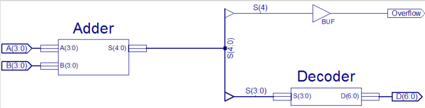
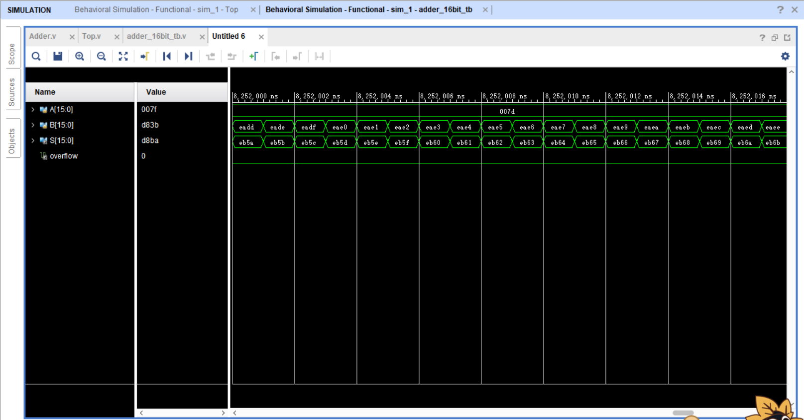
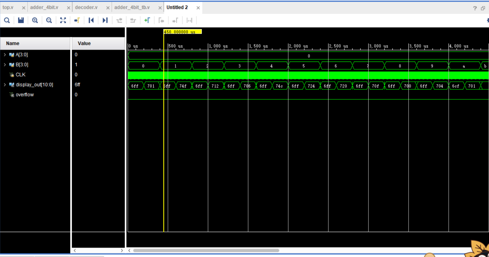
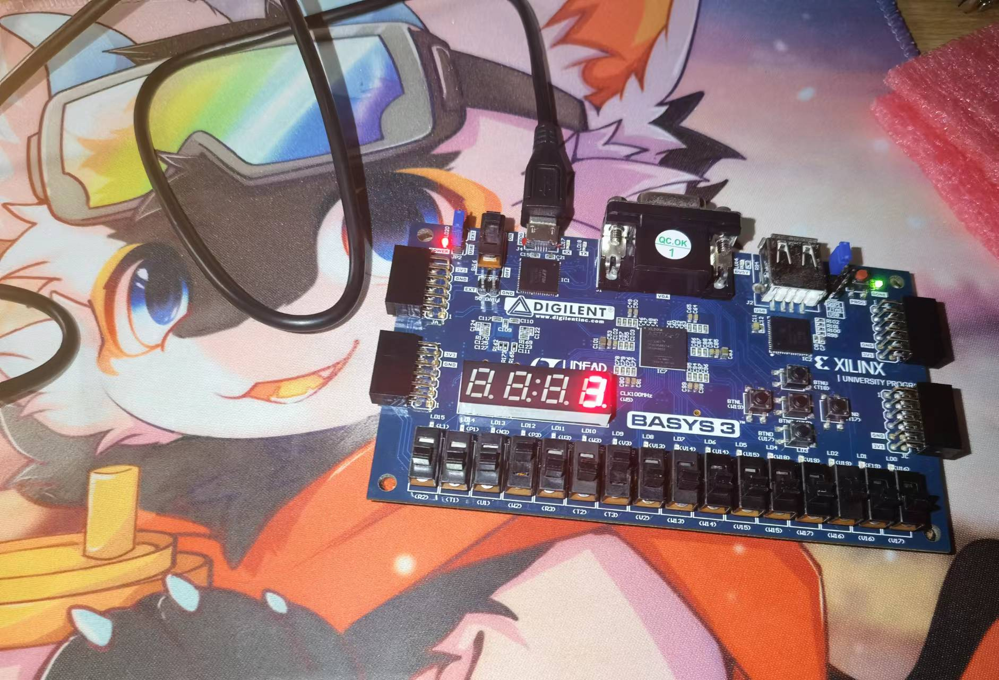

# 第一次实验报告——加法器
## 实验内容
1. 设计一个四位加法器，完成仿真和烧录
2. 设计一个十六位加法器，完成仿真
## 实验过程
### 四位加法器
#### 设计
根据下图的硬件架构，分别设计了两个子模块：`adder_4bit`和`decoder`

`adder_4bit`源代码如下：
```verilog
module adder_4bit(
    input [3:0] A,
    input [3:0] B,
    output [4:0] S
    );
    assign S = A + B;
endmodule
```
`decoder`源代码如下：
```verilog
module decoder(
    input CLK,
    input [3:0] S,
    output reg[10:0] D
    );
    
    reg sel = 0;
    integer count = 0;
    parameter FPS = 1000;
    
    always @(posedge CLK) begin
        if(sel) begin
            case(S)
                0,10: D <= 11'b1110_0000001;
                1,11: D <= 11'b1110_1001111;
                2,12: D <= 11'b1110_0010010;
                3,13: D <= 11'b1110_0000110;
                4,14: D <= 11'b1110_1001100;
                5,15: D <= 11'b1110_0100100;
                6: D <= 11'b1110_0100000;
                7: D <= 11'b1110_0001111;
                8: D <= 11'b1110_0000000;
                9: D <= 11'b1110_0000100;
                default: D <= 11'b1110_1111111;
            endcase
        end else begin
            case(S)
                10,11,12,13,14,15: D <= 11'b1101_1001111;
                default: D <= 11'b1101_1111111;
            endcase
        end
        if(count == 100_000_000 / FPS) begin
            count <= 0;
            sel = !sel;
        end else
            count <= count + 1;
    end
endmodule
```
接着使用`top`模块完成四位加法器的组装
```verilog
module top(
    input CLK,
    input [3:0] A,
    input [3:0] B,
    output overflow,
    output [10:0] display_out
    );
    
    wire[4:0] S;
    adder_4bit add(.A(A), .B(B), .S(S));
    decoder dec(.CLK(CLK), .S(S[3:0]), .D(display_out));
    assign overflow = S[4];
    
endmodule

```
#### 仿真
依次遍历A和B，仿真代码如下：
```verilog
module adder_4bit_tb;
    reg[3:0] A;
    reg[3:0] B;
    reg CLK = 0;
    wire[10:0] display_out;
    wire overflow;
    
    top uu(.CLK(CLK), .A(A), .B(B), .display_out(display_out), .overflow(overflow));
    
    always @* begin
        # 1
        if(CLK == 0)
            CLK <= 1;
        else
            CLK <= 0;
    end
    
    initial begin
        A = 0;
        repeat(16) begin
            B = 0;
            repeat(16) begin
                # 1000000
                B = B + 1;
            end
            A = A + 1;
        end
        $finish;
     end
endmodule
```
部分仿真结果如下：

#### 运行
运行结果如下：

### 十六位加法器
仿照四位加法器的样板，很容易设计得到十六位加法器，源代码如下：
`Adder.v`
```verilog
module Adder(
    input [15:0] A,
    input [15:0] B,
    output [16:0] S
    );
    assign S = A + B;
endmodule
```
`Top.v`
```verilog
module Top(
    input [15:0] A,
    input [15:0] B,
    output [15:0] S,
    output overflow
    );
    
    Adder adder(
        .A(A),
        .B(B),
        .S({overflow, S})
    );
    
endmodule
```
`Adder_16bit_tb.v`
```verilog
module adder_16bit_tb;

reg[15:0] A;
reg[15:0] B;
wire[15:0] S;
wire overflow;

Top unit(
    .A(A),
    .B(B),
    .S(S),
    .overflow(overflow)
);

initial begin
    A = 0;
    B = 0;
    repeat(65535) begin
        B = 0;
        repeat(65535) begin
            # 1
            B = B + 1;
        end
        A = A + 1;
    end
    $finish;
end
endmodule
```
仿真结果：

## 实验结果分析
四位加法器：经测试，加法功能正常，溢出也能正常显示。但溢出时译码器也会显示低四位对应数，这可以通过在`top`模块的`display_out`输出前添加对`S[4]`的判断来阻止数码管在溢出时的显示。
十六位加法器：由于所有样例测试耗时过长，仅截取部分结果测试；溢出部分独立测试。结果正常。
## 实验总结
设计时遇到的问题及吸取到的经验：

1. 模块名开头不能为数字，如`4bit_adder`是非法的，以后应该遵循一定的命名规范。
2. 错将寄存器位宽写成数组，如`reg[6:0] D`写成`reg D[6:0]`
3. 忘记了七段译码器工作原理。七段数码管针脚定义从a到b是从顶部顺时针直到中心；七段译码器输入BCD码，输出七段码。
4. 错将`top`模块的`S`写成输入，会报电平冲突错误。
5. 没有写实例名。

仿真过程可以写在一个`initial`块内，用串行思路依次写出测试逻辑，最后用`$finish;`终止仿真
