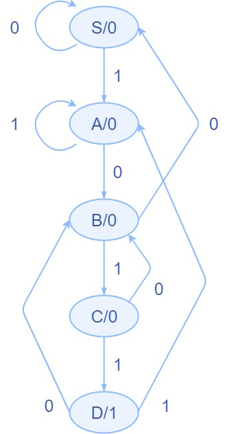
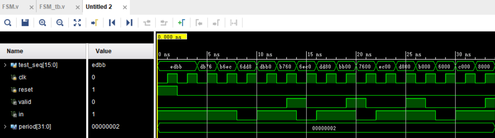

# 第二次实验报告——有限状态机
## 实验内容
使用状态机检测“1011”，串行输入的测试序列为“1110110110111011”，输出信号为valid有效信号，检测到时输出高，否则为低，考虑序列叠加情况，比如“1011011”，则有两个“1011”，这需要输出两个valid有效信号
## 实验过程
根据题目要求绘制状态转移图如下：



根据状态转移图设计状态机，源代码如下：
```verilog
module FSM(
    input reset,
    input in,
    input clk,
    output reg valid
    );
    
    localparam S=0, A=1, B=2, C=3, D=4;
    reg [2:0] state;
    reg [2:0] nxtState;
    
    always @(posedge clk) begin
        if(reset)
            state <= S;
        else
            state <= nxtState;
    end
    
    always @(*) begin
        valid <= 0;
        case(state)
            S:
            if(in) nxtState <= A;
            else nxtState <= S;
            A:
            if(in) nxtState <= A;
            else nxtState <= B;
            B:
            if(in) nxtState <= C;
            else nxtState <= S;
            C:
            if(in) nxtState <= D;
            else nxtState <= B;
            D: begin
            valid <= 1;
            if(in) nxtState <= A;
            else nxtState <= B;
            end
        endcase
    end
endmodule
```
编写仿真代码如下：
```verilog
module FSM_tb;

parameter period = 2;
reg [15:0]test_seq = 16'b1110110110111011;
reg clk;
reg reset;
wire valid;
wire in;
assign in = test_seq[15];

FSM uu(
    .reset(reset),
    .in(in),
    .clk(clk),
    .valid(valid)
);

always @(*) begin
    # (period/2)
    if(clk)
        clk <= 0;
    else
        clk <= 1;
end

initial begin
    clk <= 0;
    reset <= 1;
    # period
    reset <= 0;
    repeat(16) begin
        # period
        test_seq <= test_seq << 1;
    end
    $finish;
end
endmodule
```
## 实验结果分析
仿真结果如图：

可以发现，在每次1011后的时钟上升沿valid信号都为1，其余时刻都为0，符合题目要求
## 实验总结
状态机设计流程：

1. 根据要求绘制状态转移图
2. 根据状态转移图设计状态机
	* 用`nxtState`同步更新`state`
	* 用输入和状态异步更新`nxtState`和输出
3. 仿真实验
