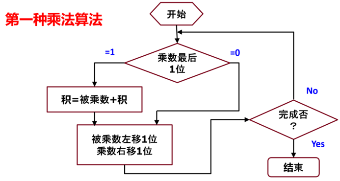
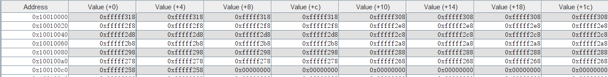
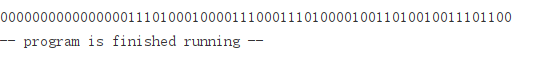
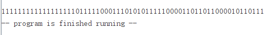
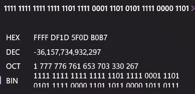
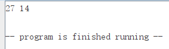

# MIPS指令集2
## 实验内容
1. 用汇编程序实现以下伪代码
```
Int main ()
{
	Int K,Y;
	Int Z[50];
	Y=56;
	For(k=0;k<50;K++) Z[k]=Y-16*(k/4+210);
}
```
2. 熟悉无符号乘法操作，并写出汇编代码`multu`和`mult`
	乘数放在`$a0`和`$a1`
	结果放在`$v0`和`$v1`中
3. 编写汇编代码完成下面程序。由于所有C程序的局部变量都保存在栈中，因此变量temp也应保存在栈中 (未优化时的情况)。
```C
void swap (int *px, int *py) {
	int temp;
	temp = *px;
	*px = *py;
	*py = temp;
}
```
## 实验过程
第一部分：实现代码如下
```mipsasm
.data
Z:	.space		200
.text
main:
	# uint32 *pZ -> $a0
	# uint32 K -> $a1
	# uint32 Y -> $a2
	la      $a0,    Z               # *pZ
	li      $a1,    0               # K = 0
	li      $a2,    56              # Y = 56
Loop:
	srl     $t0,    $a1,    2       # K/4
	addi    $t0,    $t0,    210     # K/4 + 210
	sll     $t0,    $t0,    4       # 16*(K/4 + 210)
	sub     $t0,    $a2,    $t0     # Y - 16*(K/4 + 210)
	sw      $t0,    0($a0)
	addi    $a0,    $a0,    4
	addi    $a1,    $a1,    1
	blt     $a1,    50,     Loop
End:
	li      $v0,    10
	syscall 
```
第二部分：根据给出的无符号乘法运算流程


实现无符号乘法`Multu`函数，代码如下:

```mipsasm
Multu:
# uint32 A -> $a0
# uint32 B -> $a1
# uint64 res -> {$v1, $v0}
# uint32 hi_A -> $t3
# uint32 i -> $t0
# uint32 state -> $t1
	subi    $sp,    $sp,        8
	sw      $a0,    0($sp)                  # save $a0 in $sp
	sw      $a1,    4($sp)                  # save $a1 in $sp+4
	li      $v0,    0
	li      $v1,    0
	li      $t0,    0
Loop:
	andi    $t1,    $a1,        1           # test if the lowest bit of B is 0
	beq     $t1,    0,          shift       # if ture then don't add A
	addu    $v0,    $a0,        $v0         # else add A to res
	addu    $v1,    $t3,        $v1
	sltu    $t1,    $v0,        $a0         # test if overflow
	addu    $v1,    $v1,        $t1         # overflow then add 1 to hi_res
shift:
	andi    $t1,    $a0,        0x80000000  # test if the highest bit of lo_A is 1
	srl     $t1,    $t1,        31          # adjust result to 1
	sll     $a0,    $a0,        1           # shift A
	sll     $t3,    $t3,        1
	addu    $t3,    $t3,        $t1         # adjust A
	srl     $a1,    $a1,        1           # shift B
	addiu   $t0,    $t0,        1           # ++i
	sltiu   $t1,    $t0,        32          # loop if i < 32
	bne     $t1,    $zero,      Loop
	lw      $a0,    0($sp)					# load $a0 in $sp
	lw      $a1,    4($sp)					# load $a1 in $sp+4	
	addiu   $sp,    $sp,        8
	jr      $ra
```

基于无符号乘法，实现带符号乘法`Mult`。只需进行以下改动即可：

1. 在初始化A时对高32位进行符号位扩展:
2. 在最后一次循环时如果B符号位置位，则应将积减去A，也就是加上-A
```mipsasm
Mult:
# uint32 A -> $a0
# uint32 B -> $a1
# uint64 res -> {$v1, $v0}
# uint32 hi_A -> $t3
# uint32 i -> $t0
# uint32 state -> $t1
	subi    $sp,    $sp,        8
	sw      $a0,    0($sp)                  # save $a0 in $sp
	sw      $a1,    4($sp)                  # save $a1 in $sp+4
	li      $v0,    0
	li      $v1,    0
	li      $t0,    0
	andi    $t1,    $a0,        0x80000000  # signed extend A
	beqz    $t1,    Loop
	not     $t3,    $t3
Loop:
	andi    $t1,    $a1,        1           # test if the lowest bit of B is 0
	beq     $t1,    0,          shift       # if ture then don't add A
	addu    $v0,    $a0,        $v0         # else add A to res
	addu    $v1,    $t3,        $v1
	sltu    $t1,    $v0,        $a0         # test if overflow
	addu    $v1,    $v1,        $t1         # overflow then add 1 to hi_res
shift:
	andi    $t1,    $a0,        0x80000000  # test if the highest bit of lo_A is 1
	srl     $t1,    $t1,        31          # adjust result to 1
	sll     $a0,    $a0,        1           # shift A
	sll     $t3,    $t3,        1
	addu    $t3,    $t3,        $t1         # adjust A
	srl     $a1,    $a1,        1           # shift B
	addiu   $t0,    $t0,        1           # ++i
	sltiu   $t1,    $t0,        31          # loop if i < 31
	bne     $t1,    $zero,      Loop
	seq     $t1,    $t0,        32          # corner case: if B is signed then res -= A, which means A = -A and loop it once again
	bne     $t1,    $zero,      Done
	andiu   $t1,    $a1,        1           # test if is signed
	beq     $t1,    $zero,      Done        # if not then done
	not     $a0,    $a0                     # else A = -A and loop
	not     $t3,    $t3
	addiu   $a0,    $a0,        1           # not and plus 1
	seq     $t1,    $a0,        0           # if lo_A is 0 then overflow
	addu    $v1,    $v1,        $t1         # overflow then add 1 to hi_res
	j       Loop
Done:
	lw      $a0,    0($sp)
	lw      $a1,    4($sp)
	addiu   $sp,    $sp,        8
	jr      $ra
```

第三部分：实现代码如下

	```mipsasm
	swap:
	# uint32 *px -> $a0
	# uint32 *py -> $a1
	# uint32 temp -> [sp]
		sub     $sp,    $sp,    4
		lw      $t0,    0($a0)      # temp = *px
		sw      $t0,    0($sp)
		lw      $t0,    0($a1)      # *px = *py
		sw      $t0,    0($a0)
		lw      $t0,    0($sp)      # *py = temp
		sw      $t0,    0($a1)
		addi    $sp,    $sp,    4
		jr      $ra
	```
## 实验结果分析
1. 
2. Multu:`16564564 *  15434575 = 255667005400300`
	

	result:`0b0000000000000000111010001000011100011101000010011010010011101100 = 255667005400300`

	Mult:`-423223 * 85434239 = -36157734932297`

	

	result:
	
	

3. 使用给出的main函数完成测试

	
## 实验总结
1. 无符号位移可以当作乘除二的幂次运算；带符号算数位移也可以，但对于负数右移，可以证明舍入方向为负方向（比如-5>>1=-3）
2. 无符号加法和带符号加法在硬件运算上是一样的，区别只在于溢出时带符号运算会抛出异常，而无符号不会。因此在需要自然溢出时应使用无符号加法，无论他是否被视为带符号数
3. `slt`也是区分符号的
4. 栈地址从高向低减小。函数开始时将栈指针下移，使用偏移寻址访问栈指针以上分配给该函数的内存空间；函数执行完毕在返回前将栈指针上移
