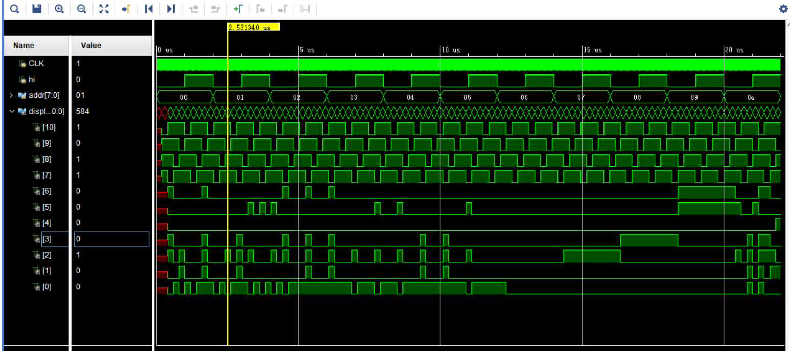
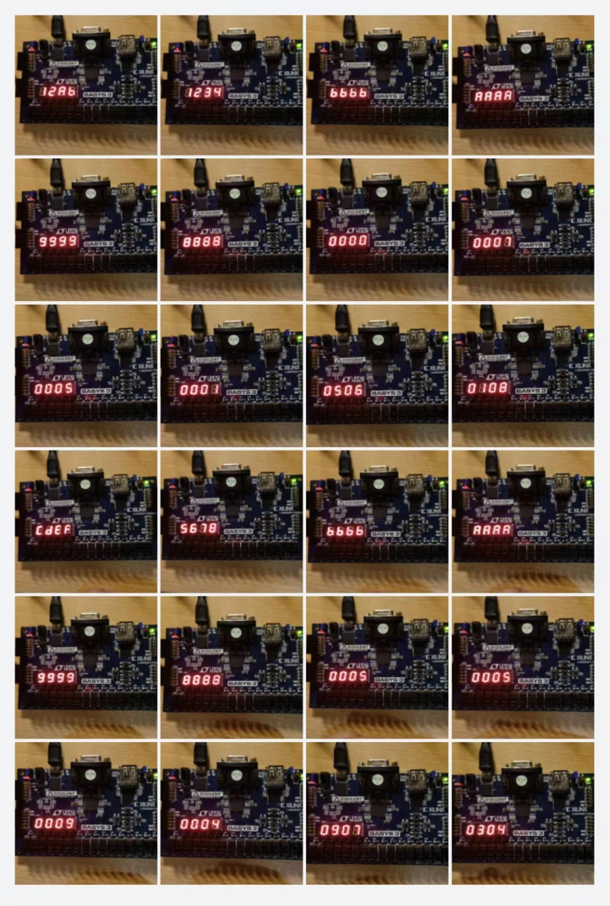

# 实验 5-存储器实验
## 实验内容
使用 Vivado 的 Block Memory Generator 模拟数据在存储器中的存取过程。初始化 ROM 存储器中的内容，通过开关选择相应的地址，将对应的存储器 中内容读出来，并通过七段数码管显示。
## 实验过程
根据实验手册创建好存储器IP，命名为`ins_Rom`，然后编写显示模块如下：
```verilog
module display_7seg(
    input CLK,
    input hi,
    input [31:0] data,
    output reg[10:0] display_out 
    );
    
    parameter T1MS=100000;
    integer count;
    reg [1:0] sel;
    reg [3:0] hw;
    
    initial begin
        sel <= 0;
        count <= 0;
    end
    
    always @(posedge CLK) begin
        if (count < T1MS) begin
            count <= count + 1;
        end else begin
            count <= 0;
            case(sel)
                0: display_out[10:7] <= 4'b0111;
                1: display_out[10:7] <= 4'b1110;
                2: display_out[10:7] <= 4'b1101;
                3: display_out[10:7] <= 4'b1011;
            endcase
            if(hi)
                case(sel)
                    0: hw[3:0] <= data[19:16];
                    1: hw[3:0] <= data[23:20];
                    2: hw[3:0] <= data[27:24];
                    3: hw[3:0] <= data[31:28];
                endcase
            else
                case(sel)
                    0: hw[3:0] <= data[3:0];
                    1: hw[3:0] <= data[7:4];
                    2: hw[3:0] <= data[11:8];
                    3: hw[3:0] <= data[15:12];
                endcase
            case(hw)
                0: display_out[6:0] <= 7'b0000001;
                1: display_out[6:0] <= 7'b1001111;
                2: display_out[6:0] <= 7'b0010010;
                3: display_out[6:0] <= 7'b0000110;
                4: display_out[6:0] <= 7'b1001100;
                5: display_out[6:0] <= 7'b0100100;
                6: display_out[6:0] <= 7'b0100000;
                7: display_out[6:0] <= 7'b0001111;
                8: display_out[6:0] <= 7'b0000000;
                9: display_out[6:0] <= 7'b0000100;
                10: display_out[6:0] <= 7'b0001000;
                11: display_out[6:0] <= 7'b1100000;
                12: display_out[6:0] <= 7'b0110001;
                13: display_out[6:0] <= 7'b1000010;
                14: display_out[6:0] <= 7'b0110000;
                15: display_out[6:0] <= 7'b0111000;
            endcase;
            if (sel == 3)
                sel <= 0;
            else
                sel <= sel + 1;
        end
    end
endmodule
```
由于实验板上只有四位七段数码管，因此需要高位选通信号`hi`。为了便于决定数码管显示内容，需要对输入的32位宽数据进行切分，这引入了`hw`寄存器和一个数码管刷新周期的延迟。
```verilog
module top(
    input CLK,
    input hi,
    input [7:0] addr,
    output [10:0] display_out
    );
    
    wire [31:0] data;
    
    ins_Rom rom (
      .clka(CLK),    // input wire clka
      .addra(addr),  // input wire [7 : 0] addra
      .douta(data)  // output wire [31 : 0] douta
    );

    display_7seg display (
        .CLK(CLK),
        .hi(hi),
        .data(data),
        .display_out(display_out)
    );
endmodule
```
最后用`top`文件整合模块
## 实验结果分析
Rom的初始化数据如下
```
memory_initialization_radix=16;
memory_initialization_vector=
01080304,
05060907,
00010004,
00050009,
00070005,
00000005,
88888888,
99999999,
Aaaaaaaa,
Bbbbbbbb,
12345678,
12abcdef;
```
模拟结果如下，经对照符合预期：

上板运行结果如下，经对照符合预期：

## 实验总结
`Block Memory Generator`是Vivado中存储器模块IP核（知识产权核），可用于生成Ram和Rom。可调节参数很多，包括端口模式、错误纠正、位宽容量、使能信号、缓冲信号等。Rom核通过`.coe`文件载入数据。
