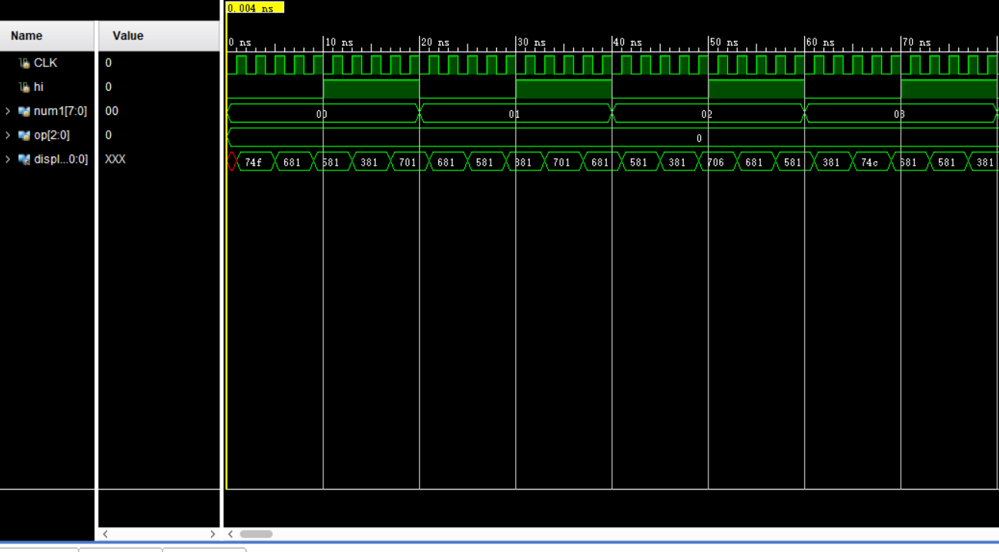
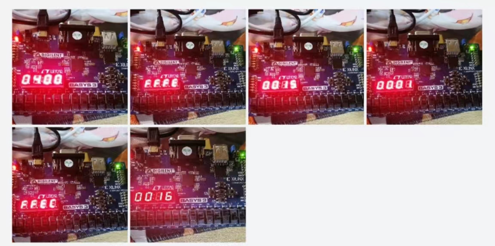
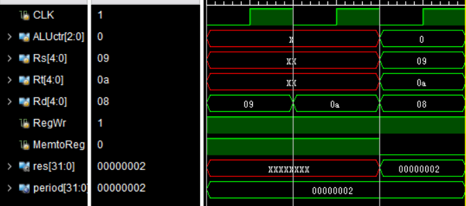

# 实验 6-寄存器堆与 ALU 设计实验
## 实验内容
1. 设计ALU
	1. 根据 ALU 原理图(图 1)，使用 Verilog 语言定义 ALU 模块，其中输入输出端口参考实验原理，运算指令码长度为[2:0]。
	2. 内置一个 32 位 num2（值为 32h’01）作为输入到运算器端口 A；
	3. 将 sw3~sw10 输入 num1, 经过符号扩展至 32 位后，输入到运算器的端口 B；
	4. 运算器支持“加、减、与、或”4 种运算，需要 3 位（8 个操作）。将 sw0~sw2 输入到 op作为运算器的控制信号；
	5. 实现 SLT 功能。
	6. 将计算 32 位结果 s 显示到七段数码管(16 进制)。
	7. 验证表 1 中所有功能。
	8. 给出 RTL 源程序（.v 文件）
2. 设计寄存器堆
	1. 根据寄存器堆（register file）原理图(图 3)，使用 Verilog 语言定义 register file 模块, 其实现方式可以参照实验给出的参照设计；
	2. 将所涉及的 ALU 与 register file 模块连起来，形成图 3 所示的系统；
	3. 图 4 在图 3 的基础上加入了多路选择器的部件，用来选择寄存器的写入数据是根据 ALU还是根据存储器来进行写入。根据图 4 中红色框框里面的原理，完成一次模拟存储器写入，通过 MemtoReg 控制信号来确定 busW 信号是来之存储器的常数还是 ALU 输出的结果，通过下列语句可以实现：busW=(MemtoReg==1)? 32'b1: result；其中假设存储器恒定输出 32'b1（也可以固定成其他值），result 是 ALU 的输出；往$t1, $t2
	里面写入 32'b1（也可以固定成其他值），通过仿真验证写入过程的正确性；
	4. 在$t1, $t2 初始值的基础上，模拟指令 add $t0, $t1, $t2 的过程，通过仿真验证 add 计算
	5. 过程的正确性。5.给出 RTL 源程序（.v 文件）
## 实验过程
1. 按照给出的原理图搭建如下框架，并编写源代码
   
	

	ALU使用case语法段选择功能，具体运算的硬件实现使用内置实现。

2. 调用给定模块和上面的alu设计并完成组装
   
	

## 实验结果分析
实验1仿真结果符合预期：

实验一上板结果（大图见附件）

实验二仿真结果：

> 注：第一个周期向`$t1`写入1，第二个周期向`$t2`写入1，第三个周期执行`add $t0,$t1,$t2`，结果为2
## 实验总结
1. 实验一中经检查综合结果，如果直接用case调用内部加减设计会得到两套加法器模块，因此这部分可以通过特别设计来优化。
2. 数码管显示模块基于上次实验进行了改进，现在可以在第一个周期就完成初始化且不会出现延迟。这是通过调整数码管刷新时机，以及使用数据选择器来实现的。
