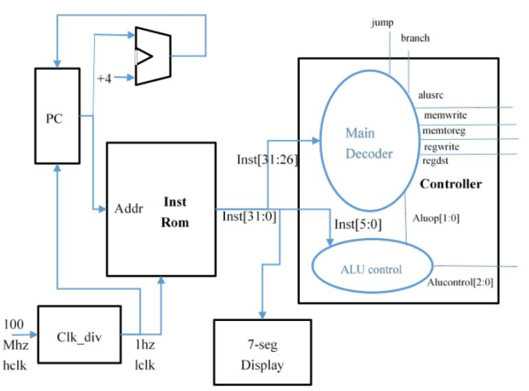
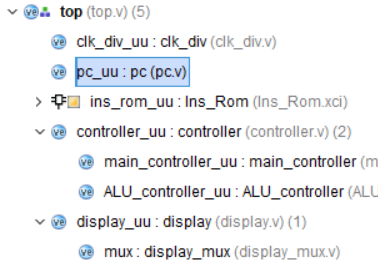
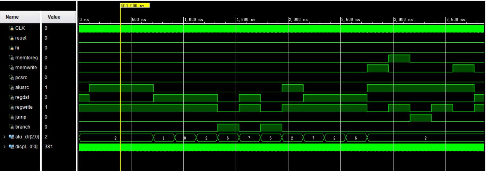
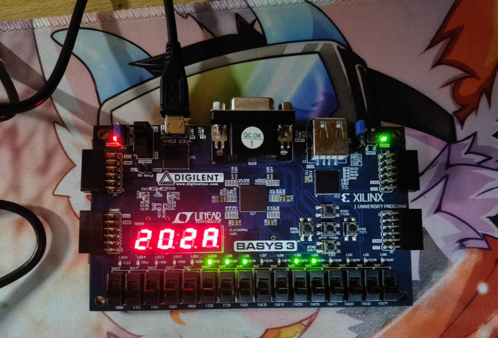
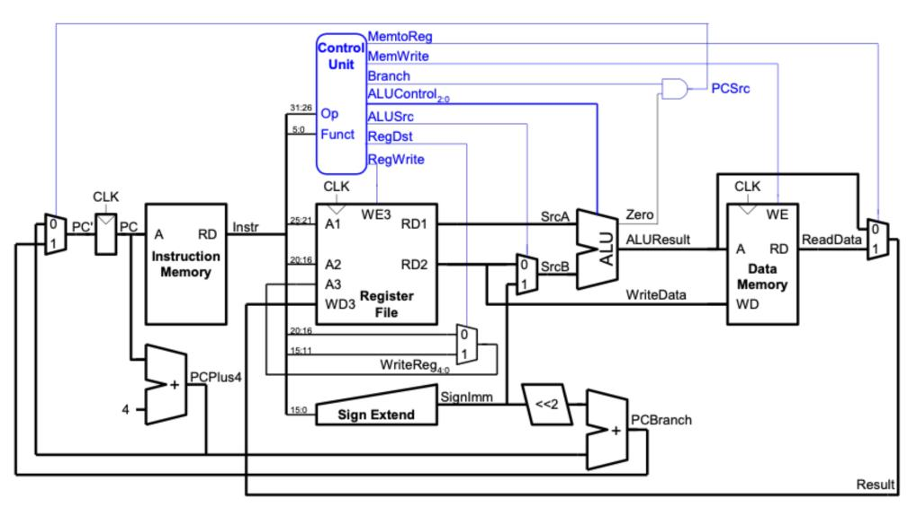

# 实验 7-存储器与控制器实验
## 实验内容
实现以下模块：

1. PC：D 触发器结构，用于储存 PC(一个周期)。需实现 2 个输入，分别为 clk, rst, 分别连接时钟和复位信号；需实现 2 个输出，分别为 pc, inst_ce, 分别连接指令存储器的 addra, ena 端口。其中 addra 位数依据 coe 文件中指令数定义；

2. 加法器。用于计算下一条指令地址，需实现 2 个输入，1 个输出，输入值分别为当前指令地址 PC、32’h4；

3. Controller。其中包含两部分：
	1. main_decoder。负责判断指令类型，并生成相应的控制信号。需实现 1 个输入，为指
	令 inst 的高 6 位 op，输出分为 2 部分，控制信号有多个，可作为多个输出，也作为一个多位输出，具体参照 4.3 进行设计；aluop 传输至 alu_decoder，使 alu_decoder 配合 inst 低 6位 funct，进行 ALU 模块控制信号的译码。
	2. alu_decoder。负责 ALU 模块控制信号的译码。需实现 2 个输入，1 个输出，输入分别为funct, aluop；输出位 alucontrol 信号。
	3. 除上述两个组件，需设计 controller 模块顶层文件调用两个 decoder，对应实现 op,funct输入信号，并传入调用模块；对应实现控制信号及 alucontrol，并连接至调用模块相应端口。

4. 指令存储器。使用 Block Memory Generator IP 构造。 (参考实验 5)

5. 时钟分频器。将板载 100Mhz 频率降低为 1hz，连接 PC、指令存储器时钟信号 clk。
## 实验过程
加入/创建工程文件和IP：  
  
分频器设计：计数100M/2次后翻转输出  
PC设计：在每个时钟上升沿，若reset为0则addr加4，否则addr清零  
主控制器：观察真值表分别编写各个信号的逻辑；由于没有加入ALU，无法获得zero信号，PCsrc信号始终为0  
ALU控制器：将逻辑转换为case语句  
display：使用上个实验模块
## 实验结果分析
### 仿真实验

从100ns（分频后时钟的第一个上升沿）开始，每200ns一个指令，执行的指令如下：

经分析其输出信号符合要求。
### 上板实验

如例图为`0064202A`，指令`slt $4, $3, $4`，输出信号为`memtoreg=0`、`memwrite=0`、`pcsrc=0`、`alusrc=0`、`regdest=1`、`regwrite=1`、`branch=0`、`jump=0`、`aluctr=7`

对照上图及信号说明可验证信号输出正确
## 实验总结
在单周期CPU中，控制器是组合逻辑电路，只需根据真值表计算每个信号的逻辑即可。

