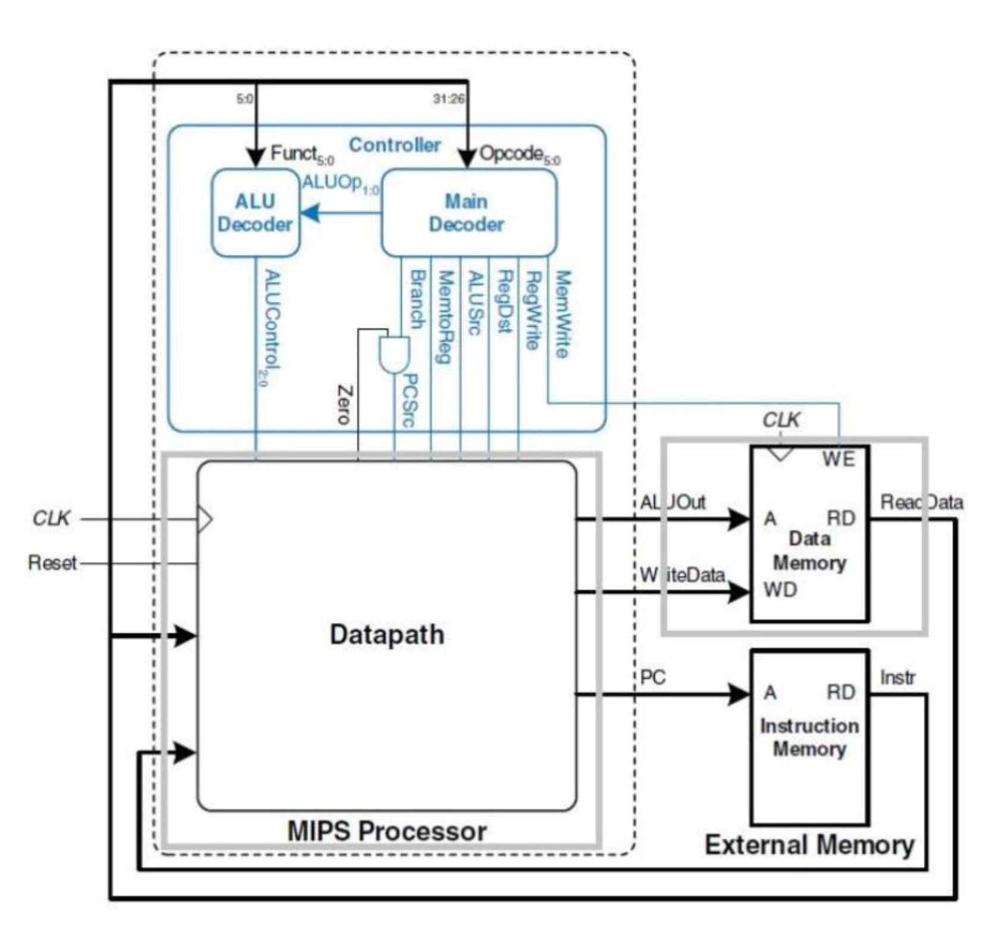
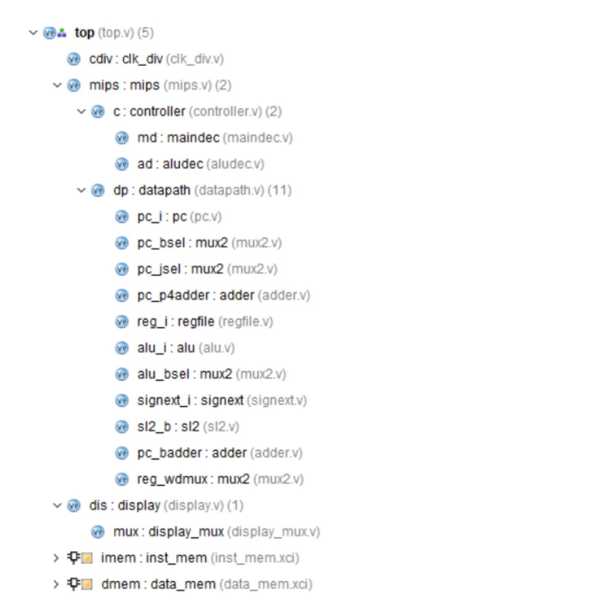
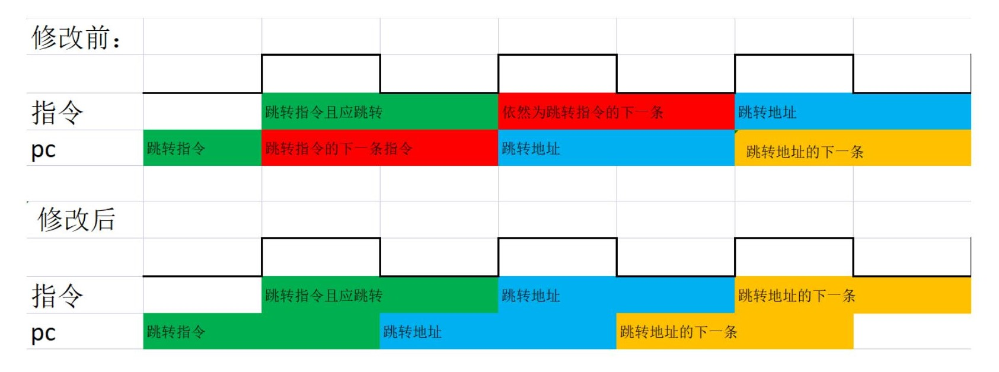
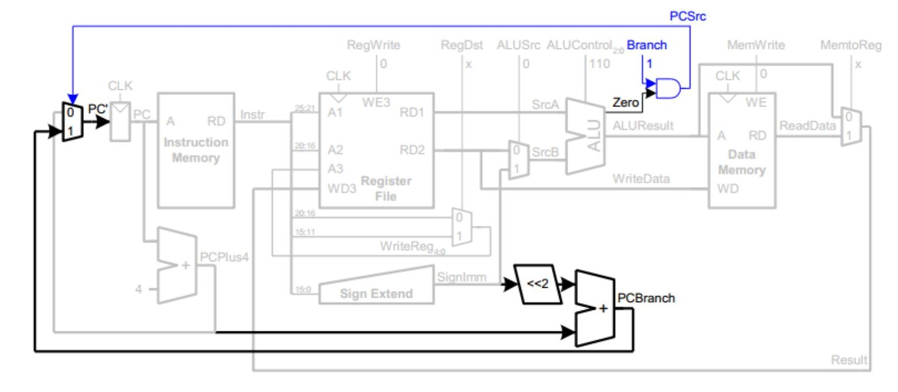
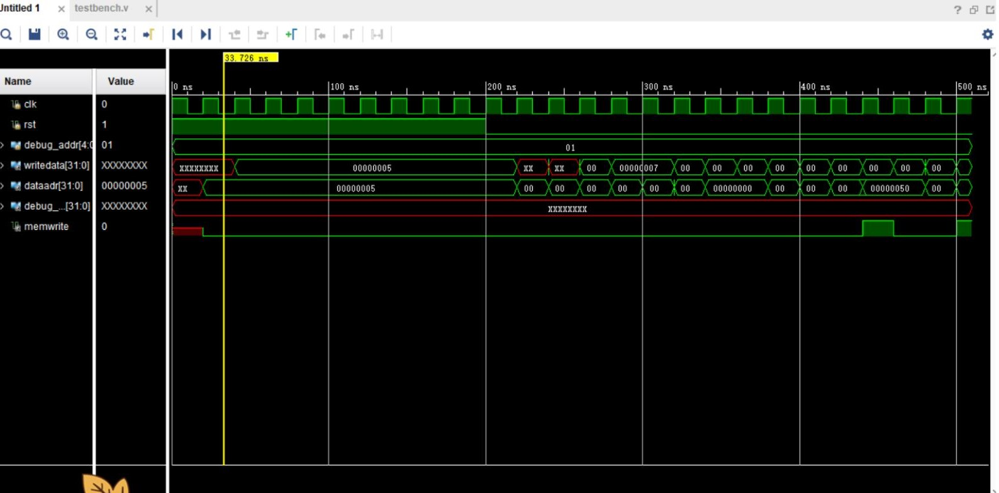
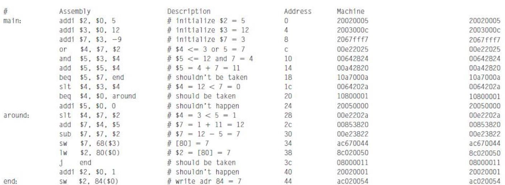
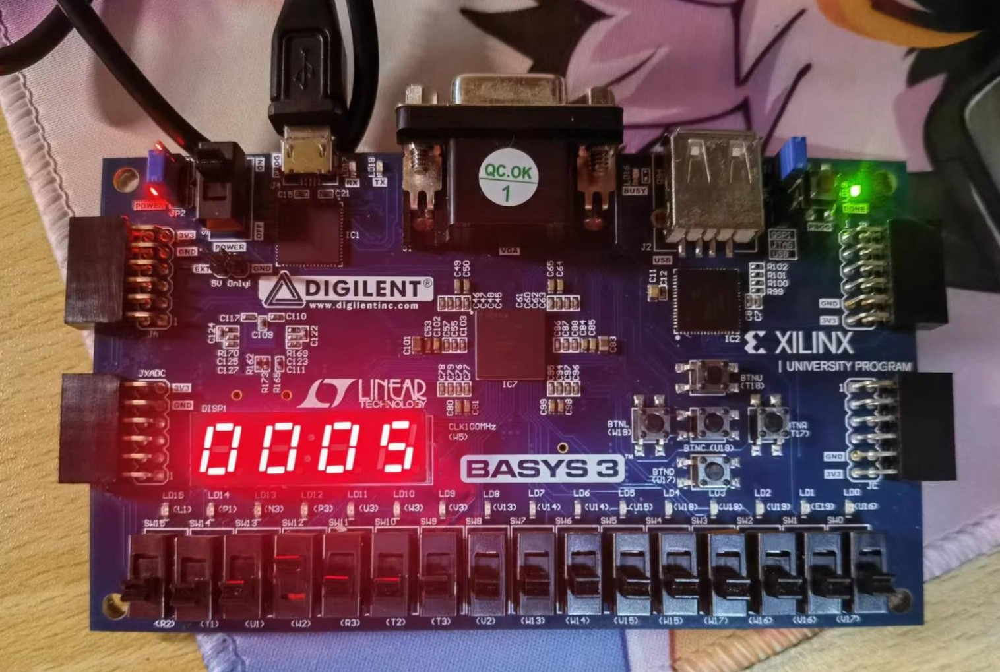

# 实验 8-单周期处理器实验
## 实验内容
设计单周期处理器

## 实验过程
参考给出的模板设计如下模块  

  

显示模块、alu、分频和控制器在之前实验已经实现，接下来主要就是datapath设计。

在我的设计中，顶层模块除了有rst重置信号外还增加了re运行使能信号，PC会在re为真的时钟*下降沿更新*——同时在下降沿更新的模块还有dmem，其他触发器都在时钟上升沿更新。

这样错开的原因是imem是同步触发的，这导致如果直接沿用理论课的设计，让PC在上升沿更新，会导致取出的指令地址是上一周期的PC，这会导致执行阶段的对PC的修改总是延迟一周期，造成程序运行错误。我观察认为问题在于PC锁存了错误的地址，因此将PC延后半周期更新，修改后时序图如下

为了得到正确信号，访存阶段前的所有信号都必须在时钟下降沿前稳定。

数据通路和控制器按下图依次连好即可

## 实验结果分析
实验仿真结果如下（未添加分频器）

由于空间有限，信号的值显示不全，但经过分析，每一个信号以及寄存器状态都是符合预期的。

上板测试结果如下。由于有re信号，可以比较从容地查看寄存器状态。经过测试，寄存器状态也是符合预期的。

## 实验总结
单周期处理器主要分为控制器和datapath，在只有一个同步元件（实验中mem是同步的，但理论上只有pc是同步元件）的情况下每周期执行一条指令，虽然会比较低效但设计比较简单。
